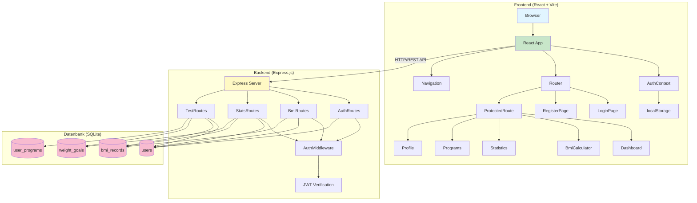
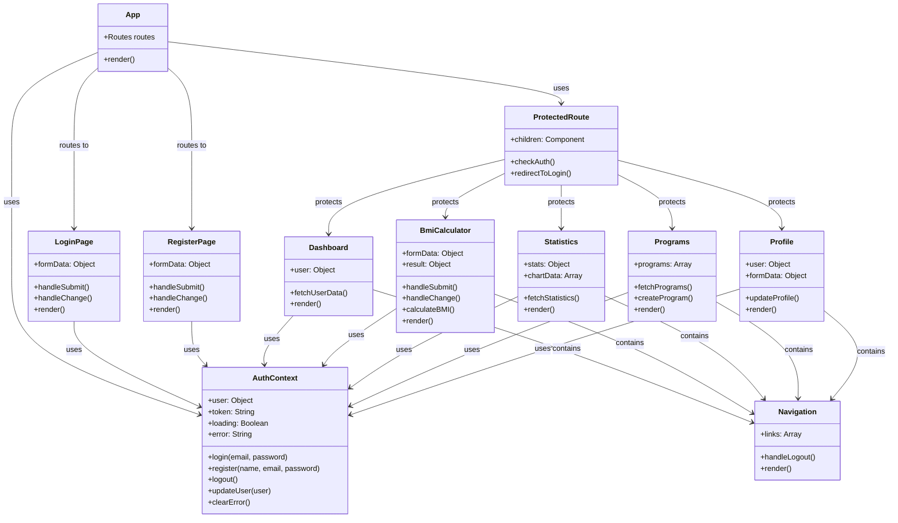
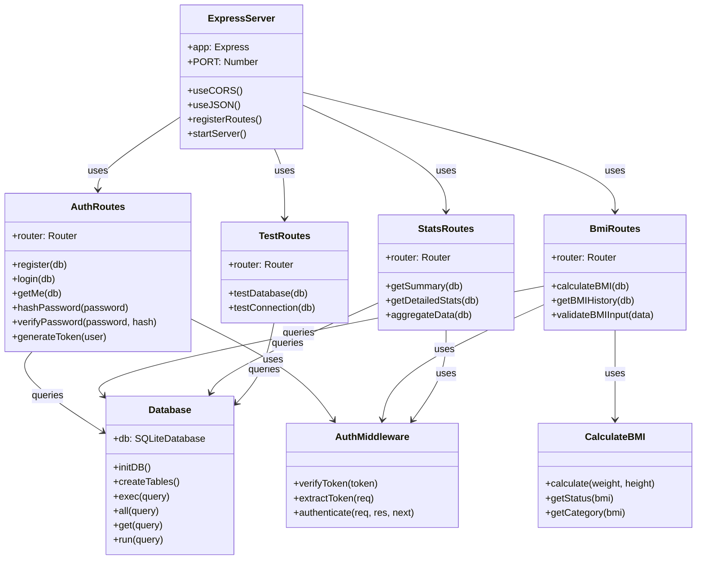
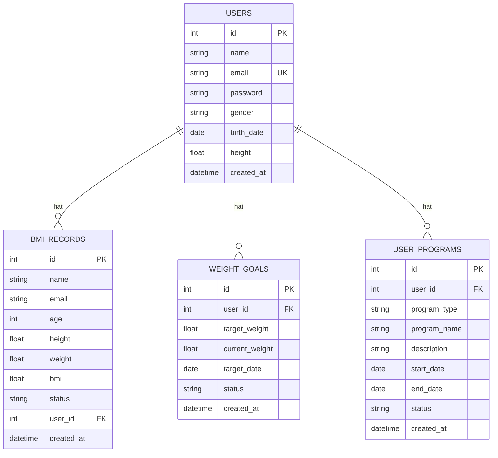
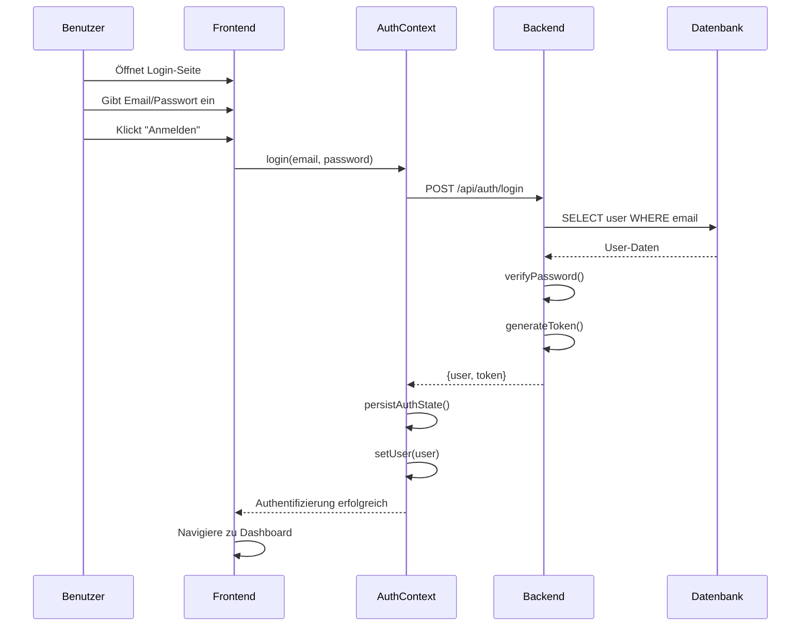
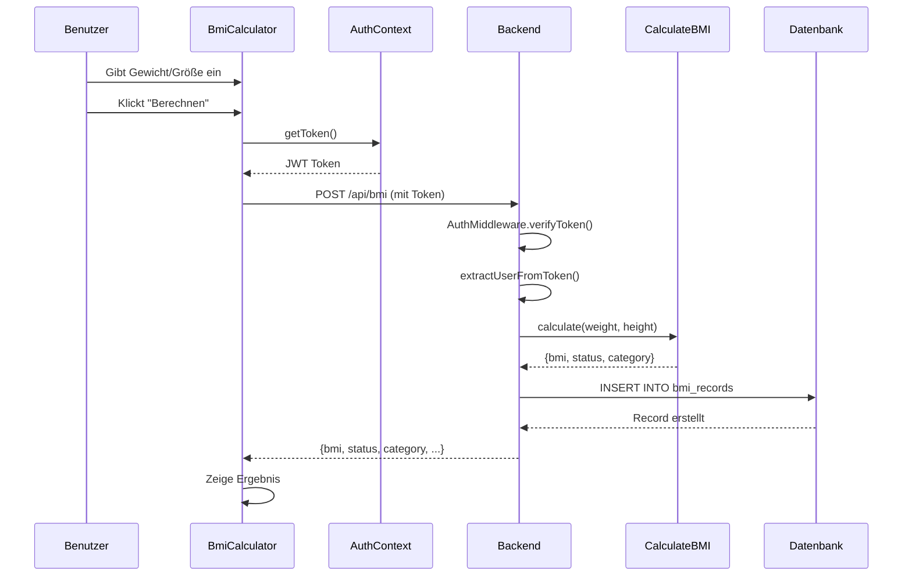
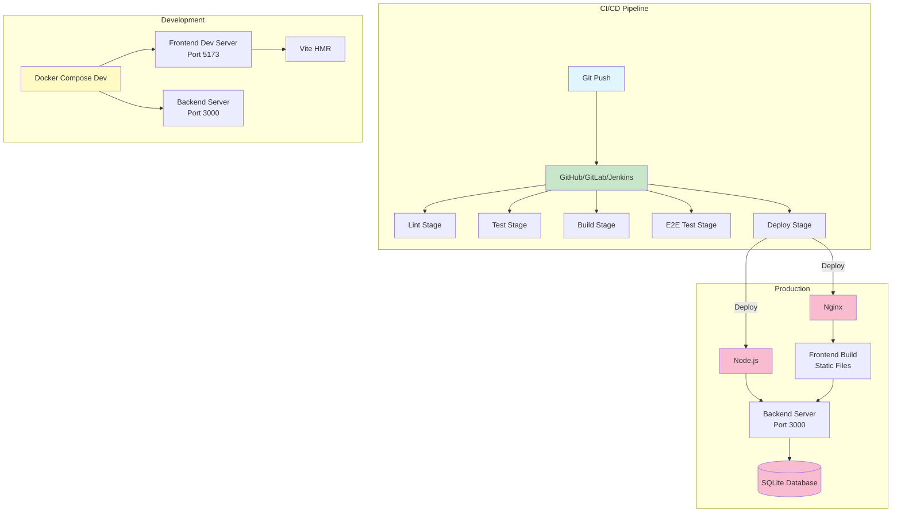
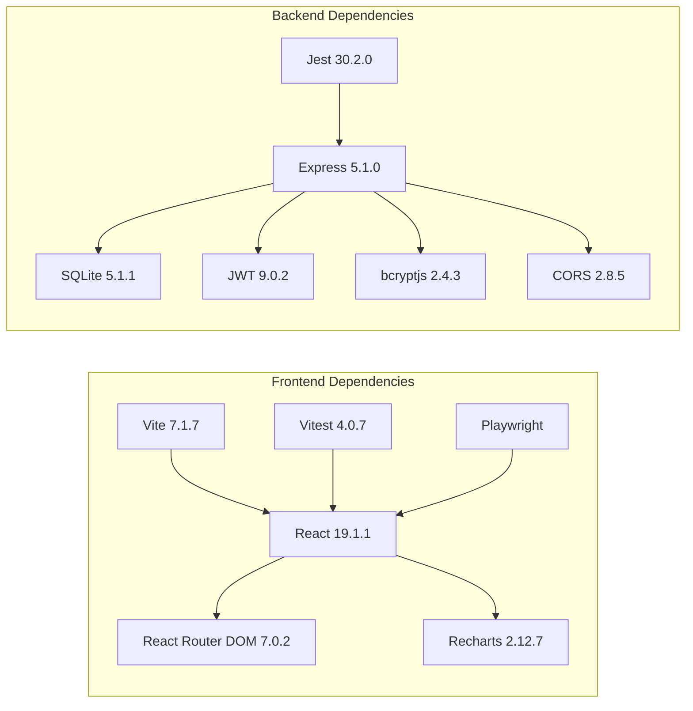
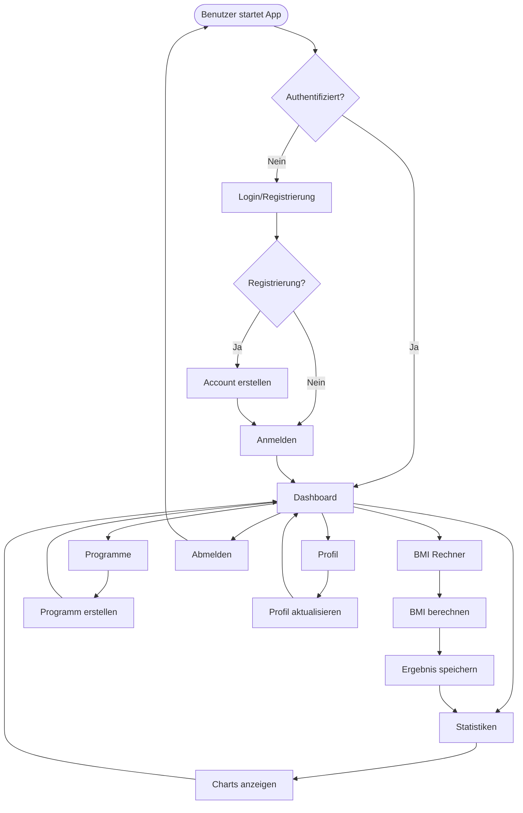
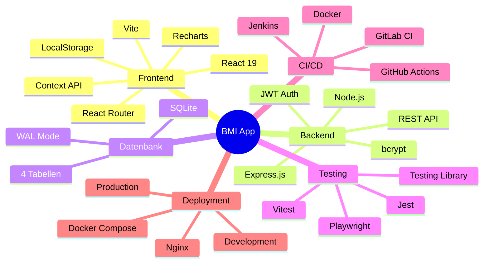

# UML Architekturdiagramm - BMI App

## 1. Komponentendiagramm - Gesamtarchitektur

## 2. Klassendiagramm - Frontend Komponenten

## 3. Klassendiagramm - Backend Architektur

## 4. Datenbankmodell (ER-Diagramm)

## 5. Sequenzdiagramm - Authentifizierung

## 6. Sequenzdiagramm - BMI-Berechnung

## 7. Deployment-Architektur

## 8. Paketdiagramm - Abhängigkeiten

## 9. Aktivitätsdiagramm - Benutzerfluss

## 10. Übersicht - Technologie-Stack

## Legende

- **Grün**: Frontend-Komponenten
- **Gelb**: Backend-Komponenten
- **Rosa**: Datenbank-Komponenten
- **Blau**: Externe Services/User

## Technische Details

### Frontend
- **Framework**: React 19.1.1
- **Build Tool**: Vite 7.1.7
- **Routing**: React Router DOM 7.0.2
- **State Management**: Context API + LocalStorage
- **Charts**: Recharts 2.12.7
- **Port**: 5173 (Development)

### Backend
- **Framework**: Express.js 5.1.0
- **Runtime**: Node.js 20
- **Authentifizierung**: JWT (jsonwebtoken 9.0.2)
- **Passwort-Hashing**: bcryptjs 2.4.3
- **CORS**: cors 2.8.5
- **Port**: 3000

### Datenbank
- **Typ**: SQLite 5.1.1
- **Modus**: WAL (Write-Ahead Logging)
- **Tabellen**: users, bmi_records, weight_goals, user_programs

### Testing
- **Frontend**: Vitest 4.0.7, Testing Library
- **Backend**: Jest 30.2.0
- **E2E**: Playwright (Chromium, Firefox, WebKit)

### CI/CD
- **Plattformen**: GitHub Actions, GitLab CI, Jenkins
- **Stages**: Lint, Test, Build, E2E, Deploy
- **Containerisierung**: Docker, Docker Compose

