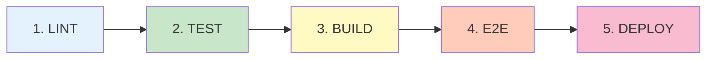
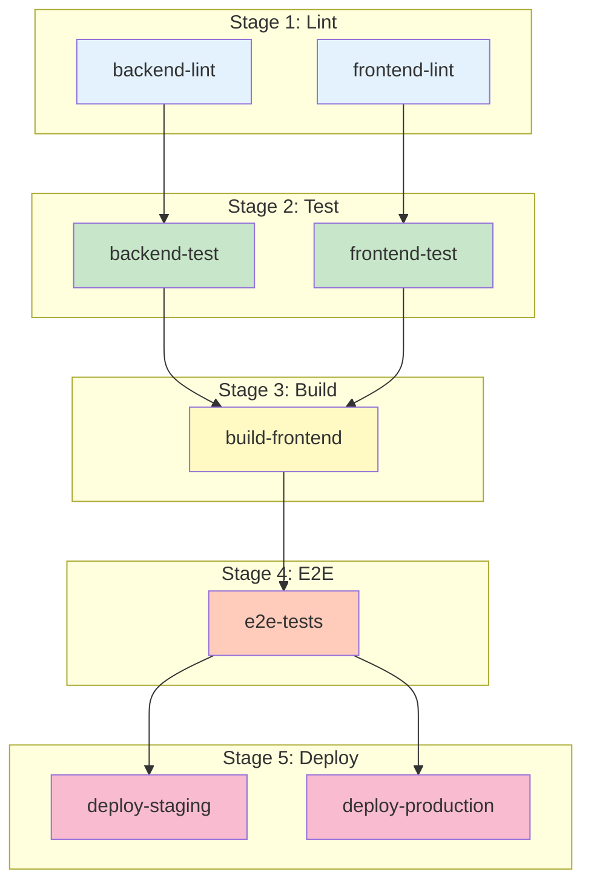
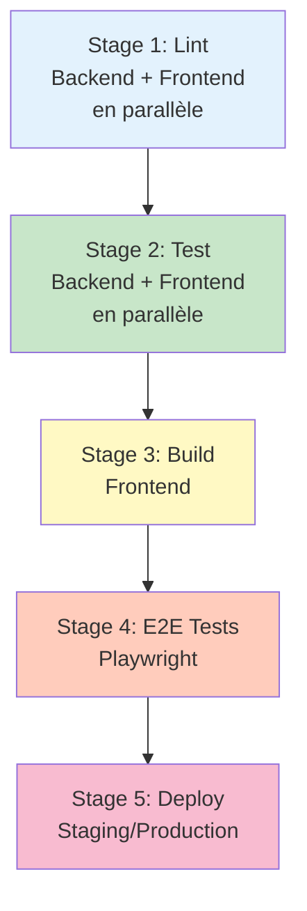
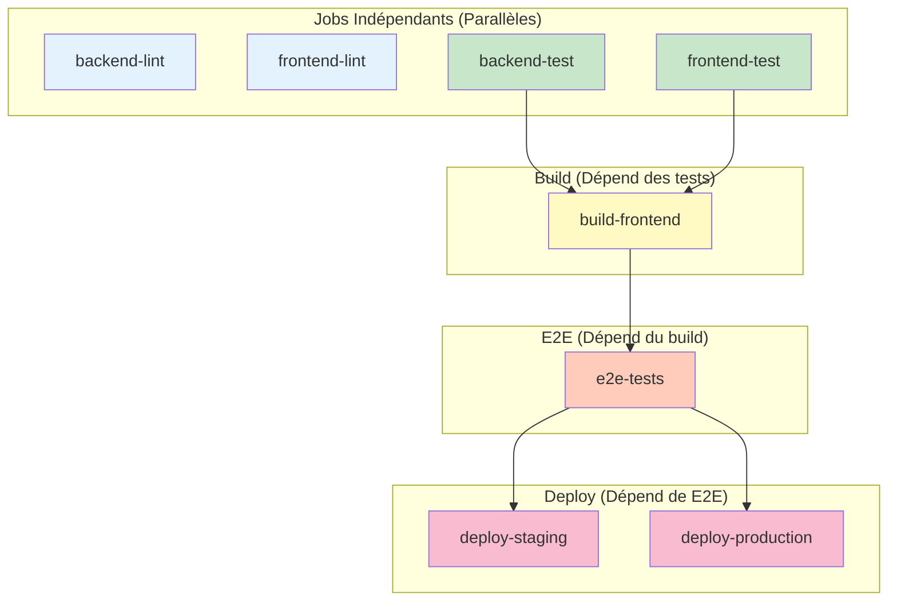
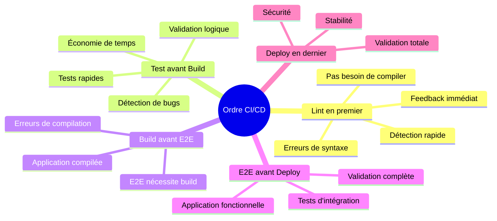
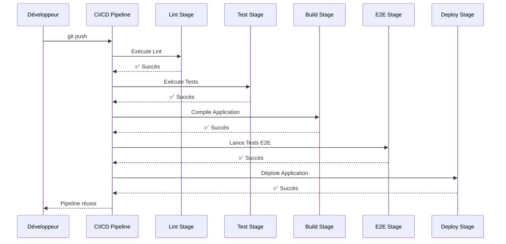
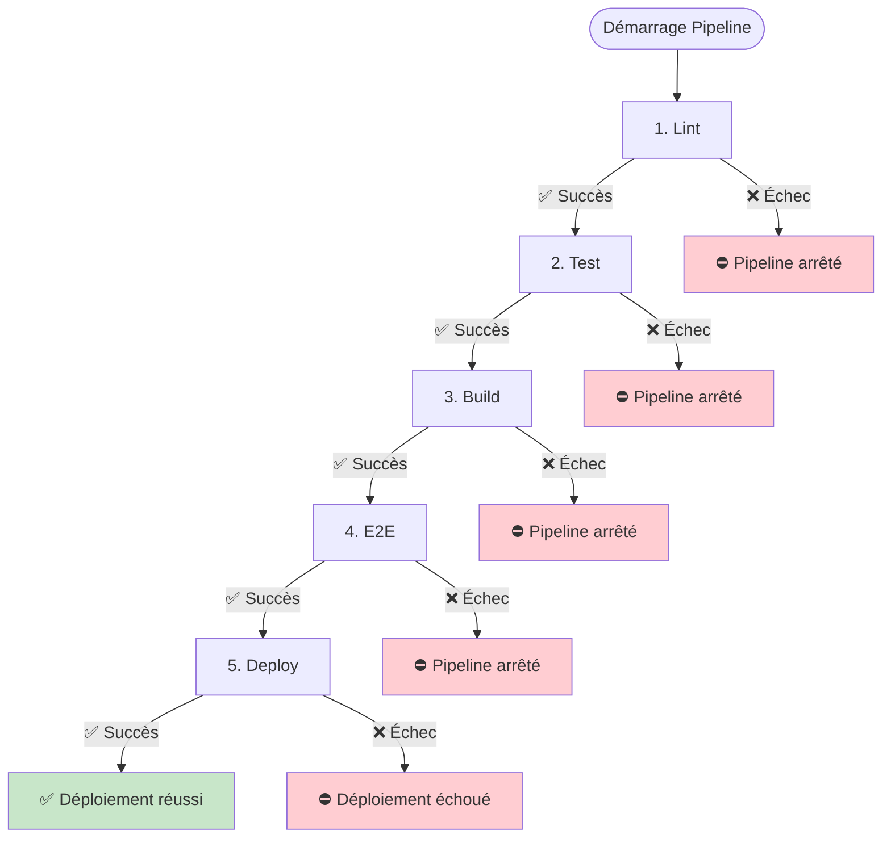
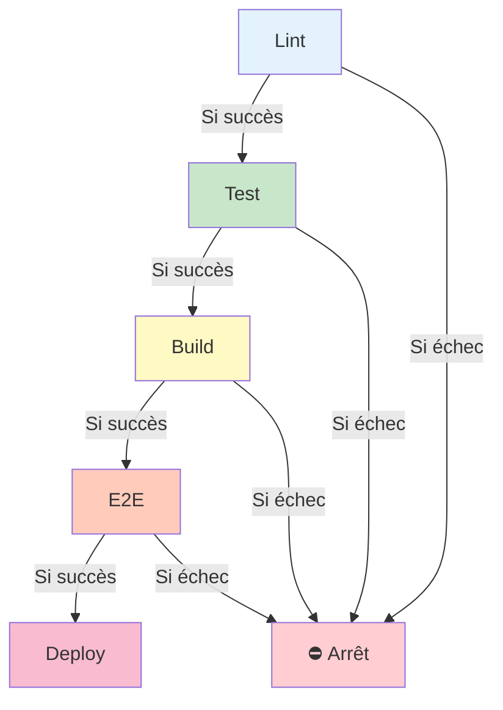
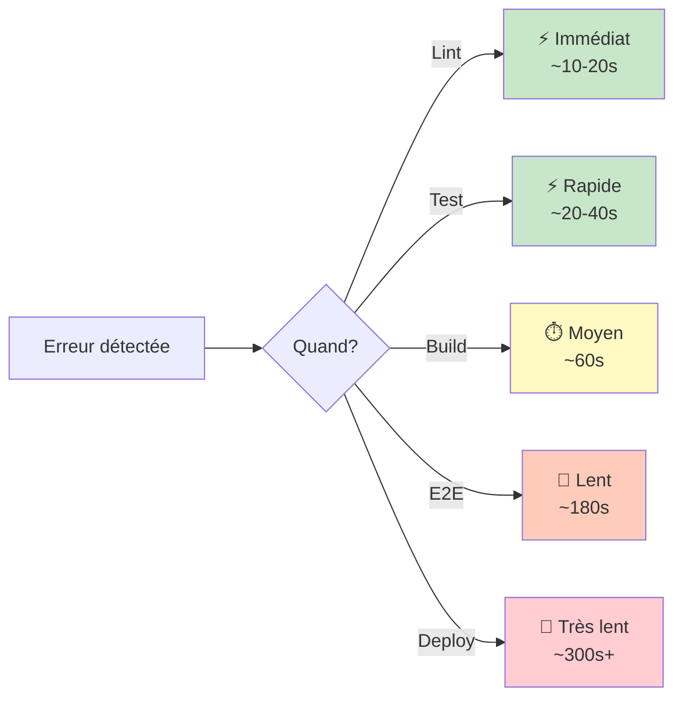

# Diagramme de l'Ordre des Stages CI/CD

## 1. Ordre Standard des Stages CI/CD



## 2. Ordre dans vos Pipelines

### GitLab CI



### Jenkins



### GitHub Actions



## 3. Justification de l'Ordre



## 4. Flux d'Exécution Détaillé



## 5. Cas d'Échec - Arrêt Précoce



## 6. Comparaison des 3 Plateformes

```mermaid
graph TB
    subgraph "GitLab CI"
        G1[Stage: lint]
        G2[Stage: test]
        G3[Stage: build]
        G4[Stage: e2e]
        G5[Stage: deploy]
        G1 --> G2 --> G3 --> G4 --> G5
    end
    
    subgraph "Jenkins"
        J1[Stage: Lint]
        J2[Stage: Test]
        J3[Stage: Build]
        J4[Stage: E2E Tests]
        J5[Stage: Deploy]
        J1 --> J2 --> J3 --> J4 --> J5
    end
    
    subgraph "GitHub Actions"
        H1[Jobs: lint]
        H2[Jobs: test]
        H3[Job: build-frontend]
        H4[Job: e2e-tests]
        H5[Jobs: deploy]
        H1 -.->|needs| H2
        H2 -.->|needs| H3
        H3 -.->|needs| H4
        H4 -.->|needs| H5
    end
    
    style G1 fill:#e3f2fd
    style G2 fill:#c8e6c9
    style G3 fill:#fff9c4
    style G4 fill:#ffccbc
    style G5 fill:#f8bbd0
    style J1 fill:#e3f2fd
    style J2 fill:#c8e6c9
    style J3 fill:#fff9c4
    style J4 fill:#ffccbc
    style J5 fill:#f8bbd0
    style H1 fill:#e3f2fd
    style H2 fill:#c8e6c9
    style H3 fill:#fff9c4
    style H4 fill:#ffccbc
    style H5 fill:#f8bbd0
```



## 7. Temps d'Exécution par Stage

```mermaid
gantt
    title Temps d'Exécution Pipeline (Exemple)
    dateFormat X
    axisFormat %s
    
    section Lint
    Backend Lint    :0, 19s
    Frontend Lint   :0, 10s
    
    section Test
    Backend Tests   :19s, 20s
    Frontend Tests  :19s, 19s
    
    section Build
    Frontend Build  :39s, 21s
    
    section E2E
    E2E Tests       :60s, 129s
    
    section Deploy
    Deploy          :189s, 1s
```

## 8. Dépendances Détaillées



## 9. Ordre Recommandé vs Votre Configuration

| Stage | Ordre Standard | Votre Configuration | Statut |
|-------|----------------|---------------------|--------|
| **Lint** | 1 | ✅ 1 | ✅ Correct |
| **Test** | 2 | ✅ 2 | ✅ Correct |
| **Build** | 3 | ✅ 3 | ✅ Correct |
| **E2E** | 4 | ✅ 4 | ✅ Correct |
| **Deploy** | 5 | ✅ 5 | ✅ Correct |

## 10. Pourquoi cet ordre est optimal ?

### Principe : "Fail Fast" (Échec Rapide)



**Conclusion :** Plus tôt on détecte une erreur, moins on perd de temps !

## Résumé

### ✅ Votre ordre est PARFAIT !

Vos pipelines suivent **exactement** l'ordre standard recommandé :

```
1. LINT   → Détection rapide des erreurs
2. TEST   → Validation de la logique
3. BUILD  → Compilation
4. E2E    → Tests complets
5. DEPLOY → Déploiement sécurisé
```

**Aucune modification nécessaire !** 🎉

