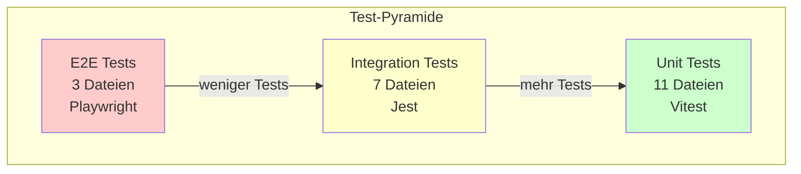
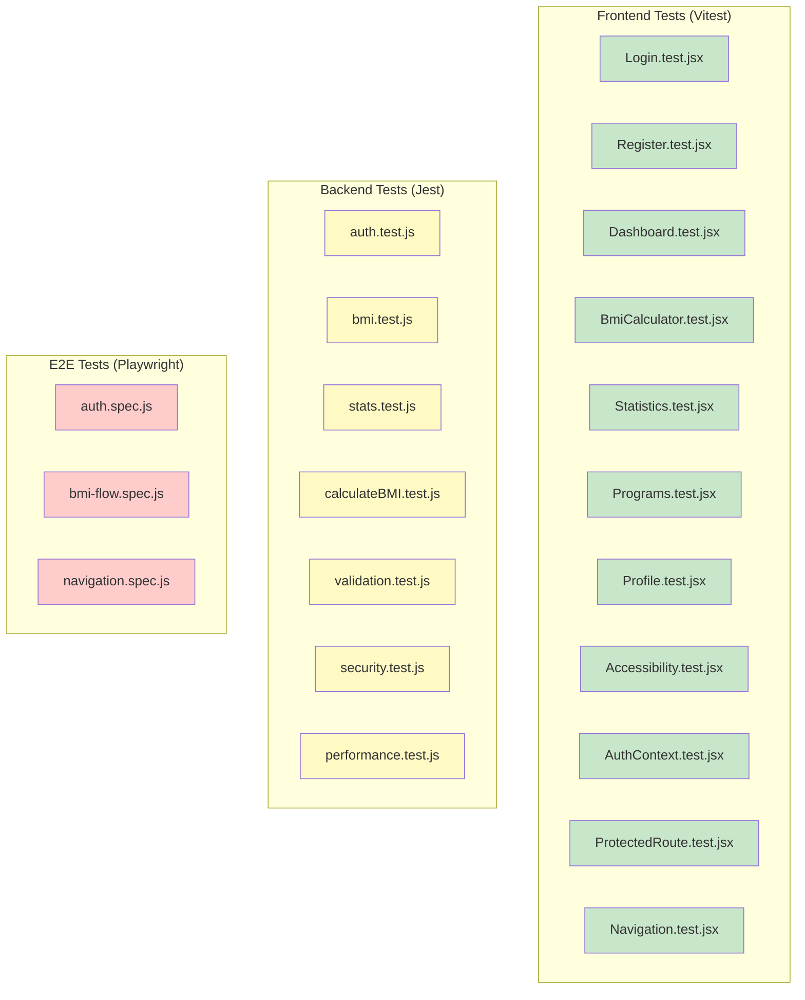
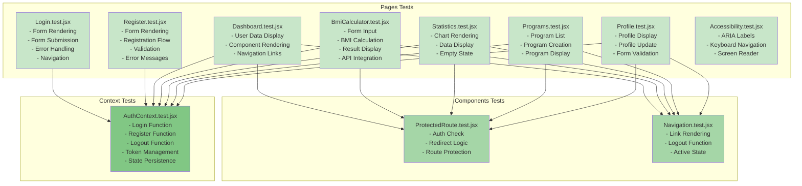
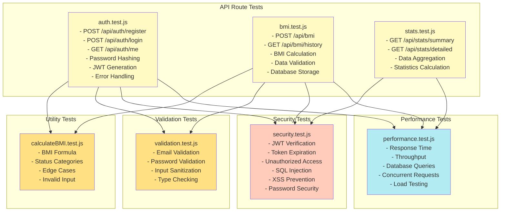
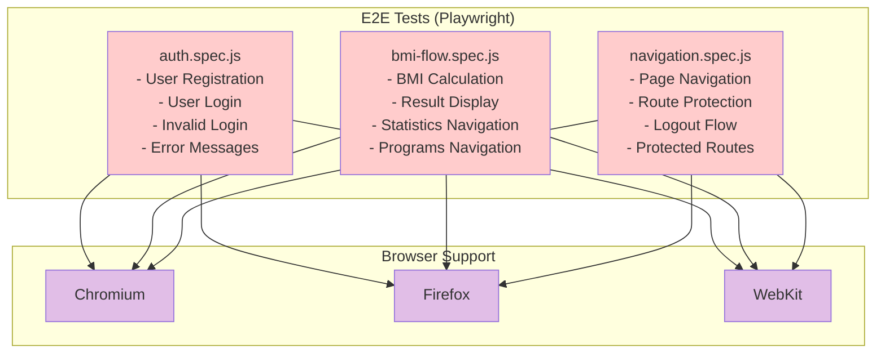
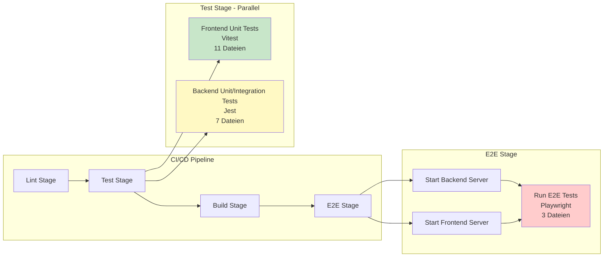
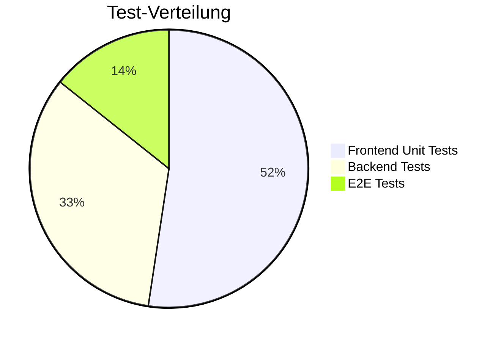
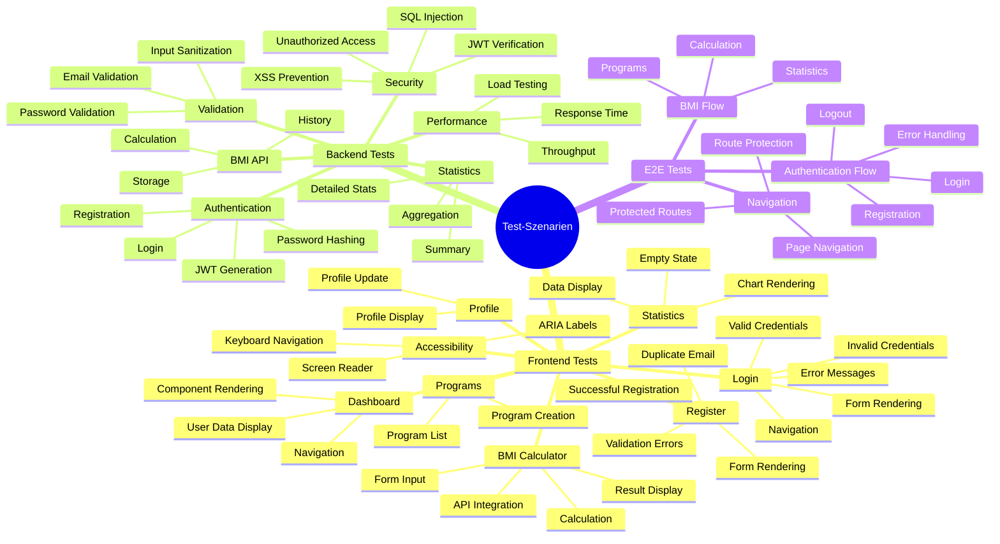
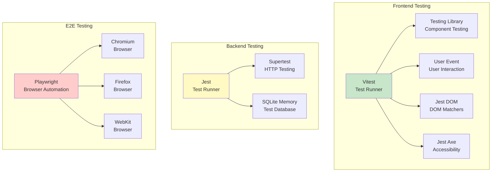
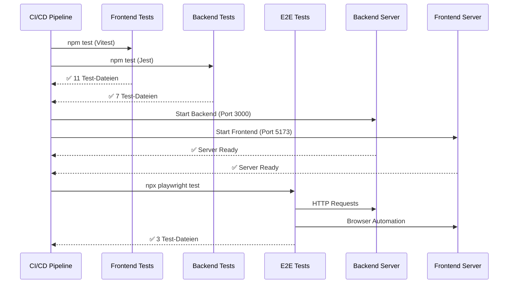

# Test-Architektur Diagramm - BMI App

## 1. Übersicht - Test-Pyramide

## 2. Test-Übersicht - Alle Test-Dateien

## 3. Frontend Tests - Detaillierte Struktur

## 4. Backend Tests - Detaillierte Struktur

## 5. E2E Tests - Detaillierte Struktur

## 6. Test-Abhängigkeiten und Ausführungsreihenfolge

## 7. Test-Coverage Übersicht

## 8. Test-Szenarien - Detaillierte Übersicht

## 9. Test-Frameworks und Tools

## 10. Test-Statistiken

### Frontend Tests (Vitest)
- **Anzahl Test-Dateien**: 11
- **Test-Framework**: Vitest 4.0.7
- **Coverage**: 97.1%
- **Test-Typen**: Unit Tests, Component Tests, Integration Tests

### Backend Tests (Jest)
- **Anzahl Test-Dateien**: 7
- **Test-Framework**: Jest 30.2.0
- **Test-Typen**: Unit Tests, Integration Tests, Performance Tests, Security Tests
- **Anzahl Tests**: ~77 Tests (inkl. 18 Performance-Tests)

### E2E Tests (Playwright)
- **Anzahl Test-Dateien**: 3
- **Test-Framework**: Playwright
- **Browser**: Chromium, Firefox, WebKit
- **Test-Typen**: End-to-End Tests, User Flow Tests

## 11. Test-Ausführung im CI/CD

## 12. Test-Kategorien

| Kategorie | Anzahl | Framework | Typ |
|-----------|--------|-----------|-----|
| **Frontend Unit Tests** | 11 | Vitest | Unit, Component |
| **Backend Unit Tests** | 4 | Jest | Unit, Integration |
| **Backend Security Tests** | 1 | Jest | Security |
| **Backend Performance Tests** | 1 | Jest | Performance |
| **Backend Validation Tests** | 1 | Jest | Validation |
| **E2E Tests** | 3 | Playwright | End-to-End |
| **TOTAL** | **21** | - | - |

## Legende

- 🟢 **Grün**: Frontend Tests (Vitest)
- 🟡 **Gelb**: Backend Tests (Jest)
- 🔴 **Rosa**: E2E Tests (Playwright)
- 🔵 **Blau**: Tools/Frameworks

## Zusammenfassung

Das Projekt umfasst **21 Test-Dateien** mit insgesamt **~150+ Tests**:

- **11 Frontend Test-Dateien** (Vitest) - Unit und Component Tests
- **7 Backend Test-Dateien** (Jest) - Unit, Integration, Security, Performance Tests
- **3 E2E Test-Dateien** (Playwright) - End-to-End Tests mit 3 Browsern

Alle Tests werden automatisch im CI/CD Pipeline ausgeführt und tragen zur Qualitätssicherung der Anwendung bei.

