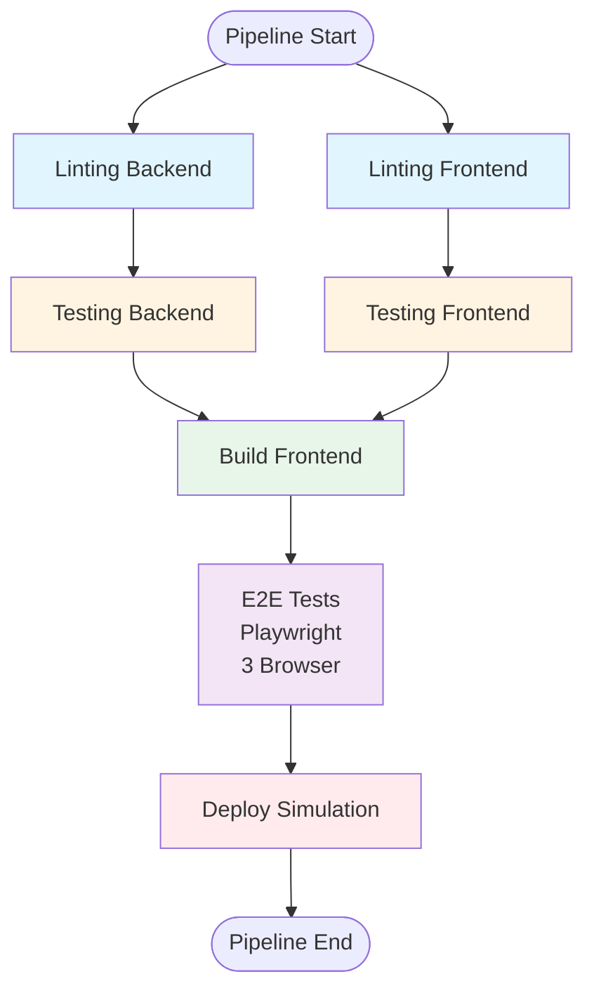

1. Einleitung

1.1 Motivation

Die Auswahl einer geeigneten CI/CD-Plattform beeinflusst Effizienz, Kosten und Wartbarkeit von Softwareentwicklungsprozessen erheblich. Über 80% der Entwicklerteams nutzen CI/CD-Tools, wobei die Plattformauswahl eine zentrale Herausforderung darstellt (JetBrains, 2023). GitHub Actions, GitLab CI und Jenkins zählen zu den führenden Plattformen, unterscheiden sich jedoch erheblich in Architektur, Konfigurationsaufwand und Funktionsumfang (Shahin et al., 2017).

Die zunehmende Integration von KI-Funktionen in CI/CD-Tools gewinnt an Bedeutung, wurde jedoch in vergleichenden Studien bislang kaum berücksichtigt (Clark, 2025). Diese Arbeit adressiert diese Lücke durch eine praxisorientierte Evaluierung der drei Plattformen anhand einer realen Webanwendung, um quantifizierbare Unterschiede zu identifizieren und praxisnahe Empfehlungen abzuleiten.

1.2 Problemstellung

Die bestehende Literatur beschreibt häufig einzelne CI/CD-Plattformen oder allgemeine Best Practices, bietet jedoch nur begrenzte systematische Vergleiche unter identischen Bedingungen (Shahin et al., 2017). Vergleichsstudien verzichten meist auf praktische Implementierungen mit realen Anwendungen, was die Quantifizierung tatsächlicher Unterschiede bei Konfigurationsaufwand, Performance und Benutzerfreundlichkeit erschwert (Shahin, Babar & Zhu, 2017).

Zudem fehlen standardisierte Methoden zur Messung und Bewertung von CI/CD-Plattformen. Forsgren et al. (2018) betonen die Bedeutung quantifizierbarer Kennzahlen wie Build- und Testzeiten, Erfolgsraten und Stabilität zur objektiven Bewertung kontinuierlicher Softwarebereitstellung. Die Übertragung dieser Metriken auf den direkten Vergleich konkreter CI/CD-Plattformen wird in der bestehenden Literatur jedoch nur vereinzelt vorgenommen (Forsgren et al., 2018).

Die Auswirkungen von KI-Unterstützung auf den Konfigurationsaufwand wurden bislang nicht systematisch untersucht (Clark, 2025). Aktuelle Erhebungen zeigen, dass KI-gestützte Assistenz- und Automatisierungsfunktionen eine wachsende Rolle im Softwareentwicklungsprozess spielen (JetBrains, 2023; JetBrains, 2025), jedoch fehlen vergleichende Analysen ihrer Effektivität in CI/CD-Kontexten.

1.3 Forschungsfragen und Zielsetzung

Hauptforschungsfrage: Wie unterscheiden sich die CI/CD-Plattformen GitHub Actions, GitLab CI und Jenkins hinsichtlich ihrer funktionalen und nicht-funktionalen Eigenschaften, und in welchem Maß eignen sie sich für unterschiedliche Anwendungskontexte?

Diese Fragestellung wurde gewählt, da sie sowohl technische Eigenschaften als auch praktische Anwendbarkeit adressiert und damit praxisnahe Empfehlungen ermöglicht (Shahin et al., 2017).

Teilfragen:
- T1: Welche funktionalen und nicht-funktionalen Unterschiede bestehen zwischen den drei Plattformen?
- T2: Wie unterscheiden sich die Plattformen hinsichtlich Konfigurationsaufwand, Wartbarkeit und Integrationsfähigkeit?
- T3: Welche Stärken und Schwächen zeigen sich bei der praktischen Anwendung in typischen CI/CD-Szenarien?
- T4: In welchem Umfang unterstützen die Plattformen KI-gestützte Automatisierungs- und Assistenzfunktionen?

Ziel dieser Arbeit ist es, die untersuchten Plattformen anhand einheitlicher Kriterien systematisch zu analysieren und praxisnahe Empfehlungen für unterschiedliche Einsatzszenarien abzuleiten (Shahin et al., 2017).

1.4 Vorgehensweise

Die Arbeit folgt einem praxisorientierten, vergleichenden Evaluierungsansatz, der theoretische Analyse mit praktischer Implementierung verbindet (Humble & Farley, 2010). Als Evaluierungsgrundlage dient eine BMI-Rechner-Webanwendung mit React-Frontend, Node.js/Express.js-Backend und SQLite-Datenbank. Diese Anwendung wurde bewusst gewählt, da sie einen realistischen, aber überschaubaren Anwendungsfall darstellt, einen gängigen Technologie-Stack nutzt und die Abbildung typischer CI/CD-Pipeline-Stages ermöglicht, ohne domänenspezifische Besonderheiten einzuführen (Clark, 2025).

Für diese Anwendung werden funktional identische CI/CD-Pipelines auf allen drei Plattformen konfiguriert. Die Pipelines umfassen die Stages: Linting (Backend/Frontend parallel), Testing (Backend/Frontend parallel), Build (Frontend), E2E-Tests (Playwright, 3 Browser) und Deploy (Simulation). Diese Stages wurden gewählt, da sie typische CI/CD-Szenarien abdecken und eine umfassende Evaluierung der Plattformfunktionalitäten ermöglichen (Humble & Farley, 2010). Die Infrastruktur-Konfigurationen variieren entsprechend den charakteristischen Betriebsmodelle der Plattformen (GitHub-gehostete Runner, GitLab Shared Runners, Jenkins Self-Hosted Runner) und werden in Kapitel 2.5 näher erläutert.

Pro Plattform werden mindestens zehn Pipeline-Durchläufe durchgeführt, um statistisch aussagekräftige Ergebnisse zu gewährleisten. Diese Anzahl wurde gewählt, da sie eine deskriptive statistische Auswertung mit Berechnung von Mittelwert, Median und Standardabweichung ermöglicht, während sie gleichzeitig im Rahmen einer Bachelorarbeit realisierbar ist (Forsgren et al., 2018).

Die Evaluation erfolgt anhand fünf Kriterien: Setup-Aufwand, Funktionalität, Performance, Benutzerfreundlichkeit und KI-Unterstützung. Diese Kriterien wurden aus der einschlägigen CI/CD- und DevOps-Literatur abgeleitet (Humble & Farley, 2010; Shahin et al., 2017; Forsgren et al., 2018). Quantitative Metriken umfassen Build- und Testzeiten, Erfolgsraten und Konfigurationsaufwand. Qualitative Bewertungen erfolgen auf einer 5-Punkte-Skala, da diese Skalenform in empirischen Studien weit verbreitet ist und eine ausgewogene Differenzierung ermöglicht (Clark, 2025).

1.5 Abgrenzung

Die Evaluierung beschränkt sich auf GitHub Actions, GitLab CI und Jenkins. Die Auswahl erfolgt, da sie unterschiedliche architektonische Ansätze repräsentieren (cloud-native, integrierte DevOps-Plattform, selbst-gehostete Open-Source-Lösung) und zu den am weitesten verbreiteten CI/CD-Werkzeugen zählen (Shahin et al., 2017; JetBrains, 2025). Eine Einbeziehung weiterer Plattformen würde den Umfang der praktischen Implementierung erheblich erhöhen und eine tiefgehende, reproduzierbare Untersuchung im Rahmen einer Bachelorarbeit erschweren.

Die praktische Evaluation erfolgt anhand einer Webanwendung. Spezialisierte Anwendungen (mobile Apps, Embedded Systems) werden nicht betrachtet, da sie zusätzliche Infrastruktur, spezialisiertes Fachwissen und einen deutlich erweiterten Untersuchungsrahmen erfordern würden (Humble & Farley, 2010). Die entwickelte Webanwendung weist jedoch typische Eigenschaften moderner Webanwendungen auf, darunter eine klare Trennung von Frontend und Backend, die Nutzung eines verbreiteten Technologie-Stacks sowie die Einbindung automatisierter Tests und CI/CD-Pipelines (Clark, 2025).

Ein tatsächliches Deployment in produktive Umgebungen wird nicht durchgeführt; der Deployment-Schritt wird simuliert, um eine hohe Vergleichbarkeit zu gewährleisten und infrastrukturelle, sicherheitsrelevante sowie kostenbedingte Einflussfaktoren auszuschließen. Diese Entscheidung wurde getroffen, da der Fokus der Untersuchung auf der Konfiguration, Ausführung und Bewertung der CI/CD-Pipelines selbst liegt, nicht auf Deployment-Infrastrukturen (Humble & Farley, 2010).

1.6 Struktur der Arbeit

Kapitel 2 beschreibt das methodische Vorgehen: Forschungsdesign, Datenerhebung, Vergleichskriterien und Messverfahren. Kapitel 3 behandelt die theoretischen Grundlagen von CI/CD. Kapitel 4 stellt die drei Plattformen vor und vergleicht sie anhand technischer Kriterien. Kapitel 5 beschreibt die technische Umsetzung: Entwicklung der BMI-Anwendung und Konfiguration der CI/CD-Pipelines. Kapitel 6 präsentiert die Evaluationsergebnisse. Kapitel 7 diskutiert die Ergebnisse, beantwortet die Forschungsfragen und gibt einen Ausblick.

Literaturverzeichnis (Kapitel 1)

Clark, T. (2025). CI/CD Unleashed: Turbocharging Software Deployment for Quicker Delivery. Apress. https://doi.org/10.1007/979-8-8688-1209-5

Forsgren, N., Humble, J., & Kim, G. (2018). Accelerate: The Science of Lean Software and DevOps – Measuring and Improving Performance. IT Revolution Press.

Humble, J., & Farley, D. (2010). Continuous Delivery: Reliable Software Releases through Build, Test, and Deployment Automation. Addison-Wesley Professional.

JetBrains. (2023). The State of Developer Ecosystem 2023. JetBrains s.r.o.

JetBrains. (2025). State of Developer Ecosystem Report 2025. JetBrains s.r.o. https://www.jetbrains.com/lp/devecosystem-2025/

Shahin, M., Babar, M. A., & Zhu, L. (2017). Continuous Integration, Delivery and Deployment: A Systematic Review on Approaches, Tools, Challenges and Practices. IEEE Access, 5, 3909–3943. https://doi.org/10.1109/ACCESS.2017.2685629

Singh, N. (2025). DevOps Security and Automation: Building, Deploying, and Scaling Modern Software Systems. BPB Publications.
