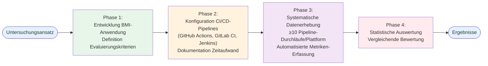

2. Methodisches Vorgehen

2.1 Forschungsdesign und Untersuchungsansatz

Diese Arbeit folgt einem praxisorientierten, empirischen Vergleichsansatz in Form einer experimentellen Fallstudie, bei der quantitative und qualitative Methoden kombiniert werden (Humble & Farley, 2010). Dieser Ansatz wurde gewählt, da er Unterschiede und Gemeinsamkeiten ausgewählter CI/CD-Plattformen anhand messbarer Leistungskennzahlen sowie nutzerbezogener Bewertungskriterien systematisch zu analysieren ermöglicht (Clark, 2025).

Drei CI/CD-Plattformen werden unter identischen Bedingungen evaluiert: gleiche Codebasis (BMI-Rechner-Webanwendung), identische Testsuiten und vergleichbare Pipeline-Stages. Diese Kontrolle der Variablen ist notwendig, um Unterschiede zwischen den Plattformen isoliert analysieren zu können und interne Validität zu gewährleisten (Forsgren et al., 2018).

Der Untersuchungsansatz gliedert sich in vier Phasen: (1) Entwicklung der BMI-Anwendung und Definition der Evaluierungskriterien, (2) Konfiguration funktional identischer CI/CD-Pipelines auf allen drei Plattformen mit Dokumentation des Zeitaufwands, (3) Systematische Datenerhebung durch mindestens zehn Pipeline-Durchläufe pro Plattform mit automatisierter Metriken-Erfassung, (4) Statistische Auswertung und vergleichende Bewertung. Diese Phasenstruktur wurde gewählt, um eine systematische, reproduzierbare Evaluierung zu gewährleisten (Shahin et al., 2017; Forsgren et al., 2018).

2.2 Vorgehensweise bei der Datenerhebung

Quantitative Metriken umfassen:
- Build- und Testzeiten: Pipeline-Gesamtdauer, stage-spezifische Laufzeiten, parallele vs. sequenzielle Ausführung. Diese Metriken werden gewählt, da sie in der Literatur als zentrale Indikatoren für die Leistungsfähigkeit und Effizienz von CI/CD-Pipelines beschrieben werden (Shahin et al., 2017; Forsgren et al., 2018).
- Erfolgs- und Fehlerraten: prozentuale Berechnung, Kategorisierung nach Fehlertyp (Konfiguration, Infrastruktur, Tests). Diese Kategorisierung ermöglicht eine gezielte Analyse von Fehlerursachen und plattformübergreifenden Vergleichen (Forsgren et al., 2018).
- Konfigurationsaufwand: Zeit von initialer Einrichtung bis erster erfolgreicher Ausführung, Komplexitätsmetriken (Zeilen Code, Jobs, Stages). Diese Metriken wurden gewählt, da sie objektivierbar sind und den Aufwand für die Einrichtung und Wartung von CI/CD-Pipelines quantifizieren (Clark, 2025).

Die Datenerfassung erfolgt automatisiert über Pipeline-APIs und Logdateien sowie skriptbasiert (scripts/analyze_performance.py). Dieses Script lädt alle Performance-Daten aus JSON-Dateien, berechnet statistische Kennwerte (Mittelwert, Median, Standardabweichung, Min/Max) und generiert automatisch einen Markdown-Bericht sowie eine JSON-Datei mit den aggregierten Statistiken. Diese Automatisierung wurde implementiert, um menschliche Fehler zu reduzieren und Reproduzierbarkeit zu gewährleisten (Forsgren et al., 2018). Pro Plattform werden mindestens zehn Pipeline-Durchläufe durchgeführt. Diese Anzahl wurde gewählt, da sie eine deskriptive statistische Auswertung mit Berechnung von Mittelwert, Median und Standardabweichung ermöglicht, während sie gleichzeitig im Rahmen einer Bachelorarbeit realisierbar ist (Forsgren et al., 2018). Die quantitative Auswertung erfolgt deskriptiv (Mittelwert μ, Median M, Standardabweichung σ, Min/Max), da diese Kennwerte eine umfassende Beschreibung der Verteilung der Messergebnisse ermöglichen (Forsgren et al., 2018).

Qualitative Bewertung erfolgt auf einer 5-Punkte-Likert-Skala für: Konfigurationssyntax, Benutzeroberfläche, Fehlermeldungen, Dokumentation, Community-Support. Diese Skalenform wurde gewählt, da sie in empirischen Studien weit verbreitet ist und eine ausgewogene Differenzierung zwischen Bewertungsstufen bei gleichzeitig überschaubarem Interpretationsaufwand ermöglicht (Clark, 2025). Die KI-Unterstützung wird durch Vergleich des Konfigurationsaufwands mit und ohne KI-gestützte Assistenzfunktionen erfasst. Diese Methode wurde gewählt, da sie eine quantitative Messung der Effektivität von KI-Unterstützung ermöglicht (Clark, 2025).

Evaluierungsgrundlage: BMI-Rechner-Webanwendung mit React-Frontend, Node.js/Express.js-Backend, SQLite-Datenbank. Diese Anwendung wurde bewusst gewählt, da sie einen realistischen, aber überschaubaren Anwendungsfall darstellt, einen gängigen Technologie-Stack nutzt und die Abbildung typischer CI/CD-Pipeline-Stages ermöglicht, ohne domänenspezifische Besonderheiten einzuführen (Clark, 2025). Testabdeckung: 77 Backend-Tests (inkl. 18 Performance-Tests), 61 Frontend-Tests (97,1% Coverage), E2E-Tests mit Playwright (Chromium, Firefox, WebKit). Diese umfassende Testabdeckung wurde implementiert, um realistische CI/CD-Szenarien abzubilden und eine aussagekräftige Evaluierung der Plattformen zu ermöglichen (Humble & Farley, 2010).

2.3 Definition der Vergleichskriterien

Die Evaluation basiert auf fünf Kriterien, die aus der CI/CD-Literatur abgeleitet wurden (Humble & Farley, 2010; Shahin et al., 2017; Forsgren et al., 2018). Diese Kriterien wurden gewählt, da sie zentrale Aspekte von CI/CD-Plattformen abdecken und eine umfassende Bewertung ermöglichen.

Kriterium 1: Setup-Aufwand und Konfiguration
Erfasst: initiale Einrichtungszeit, Konfigurationskomplexität (Zeilen Code, Jobs, Abhängigkeiten), Lernkurve, Wartungsaufwand. Dieses Kriterium wurde gewählt, da der initiale Einrichtungsaufwand eine zentrale Hürde bei der Einführung von CI/CD darstellt (Clark, 2025). Bewertung: niedrigerer Aufwand = besser, da dies die Adoption erleichtert und Ressourcen spart (Clark, 2025).

Kriterium 2: Funktionalität und Erweiterbarkeit
Bewertet: Build-Funktionalität (parallele Builds, Caching, Matrix-Builds), Test-Integration, Deployment-Features, Erweiterbarkeit (Plugins/Actions, Custom Scripts). Dieses Kriterium wurde gewählt, da der Funktionsumfang die Flexibilität und Anpassungsfähigkeit einer Plattform bestimmt (Clark, 2025). Bewertung: höhere Funktionalität = besser, da dies mehr Einsatzszenarien ermöglicht (Humble & Farley, 2010).

Kriterium 3: Performance
Umfasst: Build- und Testzeiten, Stabilität (Erfolgsrate, Fehlerrate), Ressourcennutzung. Dieses Kriterium wurde gewählt, da Performance einen direkten Einfluss auf Entwicklungsgeschwindigkeit und Produktivität hat (Forsgren et al., 2018). Messung: automatisierte Erfassung über Pipeline-Logs (10+ Durchläufe), Berechnung statistischer Kennwerte. Diese Methode wurde gewählt, um objektive, reproduzierbare Messungen zu gewährleisten (Forsgren et al., 2018). Bewertung: schnellere Zeiten, höhere Stabilität = besser, da dies kürzere Feedback-Zyklen und zuverlässigere Prozesse ermöglicht (Humble & Farley, 2010).

Kriterium 4: Benutzerfreundlichkeit
Bewertet: Konfigurationssyntax, Benutzeroberfläche, Fehlerbehandlung, Dokumentation, Community-Support. Dieses Kriterium wurde gewählt, da Benutzerfreundlichkeit die Adoption und Produktivität beeinflusst (Clark, 2025). Bewertung: höhere Benutzerfreundlichkeit = besser, da dies die Lernkurve reduziert und Fehler minimiert (Clark, 2025).

Kriterium 5: KI-Unterstützung
Erfasst: Verfügbarkeit (GitHub Copilot, GitLab AI, Jenkins Plugins), Konfigurationsunterstützung, Effektivität (Zeitersparnis, Qualität). Dieses Kriterium wurde gewählt, da KI-Unterstützung zunehmend an Bedeutung gewinnt und die Effizienz von CI/CD-Konfigurationen beeinflussen kann (Clark, 2025; JetBrains, 2025). Bewertung: bessere KI-Unterstützung = besser, da dies den Konfigurationsaufwand reduziert (Clark, 2025).

Alle Kriterien werden gleichgewichtet, um eine neutrale und anwendungsszenarienunabhängige Vergleichbarkeit der Plattformen zu gewährleisten. Eine Gewichtung einzelner Kriterien wird bewusst vermieden, da die Relevanz der Kriterien stark vom jeweiligen Einsatzkontext abhängt (Clark, 2025).

2.4 Messverfahren und Auswertungskonzept

Performance-Messung: Gesamtlaufzeit (Trigger bis Abschluss), stage-spezifische Laufzeiten (Linting, Tests, Build, E2E-Tests). Diese Messungen werden durchgeführt, da Build- und Testzeiten zentrale Indikatoren für die Leistungsfähigkeit von CI/CD-Pipelines sind (Forsgren et al., 2018). Statistische Kennwerte: Mittelwert (μ), Median (M), Standardabweichung (σ), Min/Max über mindestens zehn Durchläufe. Diese Kennwerte wurden gewählt, da sie eine umfassende Beschreibung der Verteilung der Messergebnisse ermöglichen und Ausreißer identifizieren (Forsgren et al., 2018).

Konfigurationsaufwand-Messung: Zeitmessung (Start bis erste erfolgreiche Ausführung), Komplexitätsmetriken (Zeilen Code, Jobs/Stages, Abhängigkeiten, Verschachtelungstiefe), Lernaufwand (Iterationen, Fehler, Dokumentationsumfang). Diese Metriken wurden gewählt, da sie objektivierbar sind und den Aufwand für die Einrichtung und Wartung quantifizieren (Clark, 2025).

Erfolgs- und Fehlerraten: prozentuale Berechnung, Kategorisierung (Konfiguration, Infrastruktur, Tests, Umgebung). Diese Kategorisierung wurde gewählt, da sie eine gezielte Analyse von Fehlerursachen ermöglicht (Forsgren et al., 2018).

Qualitative Bewertung: 5-Punkte-Likert-Skala (1=sehr schlecht bis 5=sehr gut) für Konfigurationssyntax, Benutzeroberfläche, Fehlermeldungen, Dokumentation, Community-Support. Diese Skalenform wurde gewählt, da sie in empirischen Studien weit verbreitet ist und eine ausreichende Differenzierung bei gleichzeitig überschaubarem Interpretationsaufwand ermöglicht (Clark, 2025). Zur Reduktion subjektiver Einflüsse werden die Bewertungen anhand vorab definierter Kriterien durchgeführt und systematisch protokolliert (Clark, 2025).

Auswertung: deskriptive Statistik (Tabellen, Grafiken), vergleichende Analyse (Stärken/Schwächen, Ranking), qualitative Synthese (Erfahrungen, Muster, Best Practices). Diese mehrstufige Auswertung wurde gewählt, um sowohl quantitative als auch qualitative Aspekte zu berücksichtigen (Forsgren et al., 2018).

Automatisierte Analyse: Python-Script (scripts/analyze_performance.py), JSON-Datenspeicherung (results/performance/*.json), automatische Generierung von statistischen Berichten (results/STATISTIQUES_PERFORMANCE.md, results/statistiques_performance.json). Dieses Script berechnet für jede Plattform statistische Kennwerte (Mittelwert, Median, Standardabweichung, Min/Max) sowohl für die Gesamtdauer als auch für jeden einzelnen Stage. Diese Automatisierung wurde implementiert, um menschliche Fehler zu reduzieren und Reproduzierbarkeit zu gewährleisten (Forsgren et al., 2018). Reproduzierbarkeit: versionierte Konfigurationsdateien, strukturierte Messprotokolle, automatisierte Scripts, dokumentierte Umgebungsvariablen. Diese Maßnahmen wurden gewählt, um die Wiederholbarkeit der Untersuchung zu gewährleisten (Humble & Farley, 2010; Forsgren et al., 2018).

2.5 Validität und Grenzen der Methodik

Interne Validität: Kontrollierte Variablen sind identische Codebasis, Testsuite und Pipeline-Stages. Diese Kontrolle wurde gewählt, um Unterschiede zwischen den Plattformen isoliert analysieren zu können (Forsgren et al., 2018). Störfaktoren: Infrastruktur-Unterschiede (dokumentiert, Fokus auf relative Unterschiede), Netzwerk-Latenz (mehrfache Messungen, Mittelwertbildung), Cache-Effekte (dokumentiert). Die Evaluierung nutzt die typischen bzw. standardmäßigen Runner-Konfigurationen jeder Plattform: GitHub Actions verwendet GitHub-gehostete Runner (ubuntu-latest), GitLab CI verwendet Shared Runners (Standard-Konfiguration des Free-Tiers), und Jenkins verwendet Self-Hosted Runner (entspricht der typischen Jenkins-Architektur). Diese Konfigurationen wurden gewählt, da sie die praxisüblichen und kostenfrei verfügbaren Optionen repräsentieren. Diese Faktoren werden dokumentiert und bei der Interpretation berücksichtigt, wobei der Fokus auf relativen Unterschieden zwischen den Plattformen liegt (Clark, 2025).

Externe Validität: Evaluation anhand einer Webanwendung mit repräsentativem Technologie-Stack (React, Node.js, SQLite). Die entwickelte Webanwendung weist typische Eigenschaften moderner Webanwendungen auf, darunter eine klare Trennung von Frontend und Backend, die Nutzung eines verbreiteten Technologie-Stacks sowie die Einbindung automatisierter Tests und CI/CD-Pipelines (Humble & Farley, 2010). Ergebnisse sind primär auf ähnliche Webanwendungen übertragbar. Absolute Performance-Werte sind stark von der Infrastruktur abhängig (Clark, 2025).

Reliabilität: Reproduzierbarkeit durch dokumentierte, versionierte Konfigurationsdateien, strukturierte Messprotokolle, automatisierte Scripts. Diese Maßnahmen wurden gewählt, um die Wiederholbarkeit der Messungen zu gewährleisten (Forsgren et al., 2018). Konsistenz durch standardisierte Messverfahren, strukturierte Bewertungskriterien, mehrfache Messungen. Diese Maßnahmen wurden gewählt, um konsistente Ergebnisse zu gewährleisten (Clark, 2025).

Konstruktvalidität: Alle Vergleichskriterien sind klar definiert mit messbaren Indikatoren. Komplexe Konzepte werden durch mehrere Subkriterien abgebildet, um einseitige oder vereinfachende Bewertungen zu vermeiden (Clark, 2025).

Methodische Grenzen: Zeitliche Begrenzung (Evaluierung zu bestimmtem Zeitpunkt), Umfang (Fokus auf Standard-Funktionalitäten), Infrastruktur-Abhängigkeit (Verwendung typischer Runner-Konfigurationen: GitHub-gehostete Runner, GitLab Shared Runners, Jenkins Self-Hosted Runner – diese Unterschiede reflektieren die charakteristischen Betriebsmodelle der Plattformen), Subjektivität bei qualitativen Bewertungen (strukturierte Kriterien, Dokumentation). Diese Einschränkungen sind typisch für praxisorientierte CI/CD-Studien und müssen bei der Interpretation der Ergebnisse berücksichtigt werden (Humble & Farley, 2010).

Literaturverzeichnis (Kapitel 2)

Clark, T. (2025). CI/CD Unleashed: Turbocharging Software Deployment for Quicker Delivery. Apress. https://doi.org/10.1007/979-8-8688-1209-5

Forsgren, N., Humble, J., & Kim, G. (2018). Accelerate: The Science of Lean Software and DevOps – Measuring and Improving Performance. IT Revolution Press.

Humble, J., & Farley, D. (2010). Continuous Delivery: Reliable Software Releases through Build, Test, and Deployment Automation. Addison-Wesley Professional.

JetBrains. (2025). State of Developer Ecosystem Report 2025. JetBrains s.r.o. https://www.jetbrains.com/lp/devecosystem-2025/

Shahin, M., Babar, M. A., & Zhu, L. (2017). Continuous Integration, Delivery and Deployment: A Systematic Review on Approaches, Tools, Challenges and Practices. IEEE Access, 5, 3909–3943. https://doi.org/10.1109/ACCESS.2017.2685629

Singh, N. (2025). DevOps Security and Automation: Building, Deploying, and Scaling Modern Software Systems. BPB Publications.
