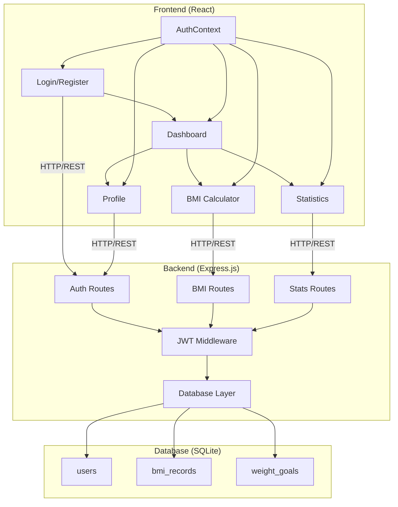
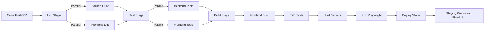
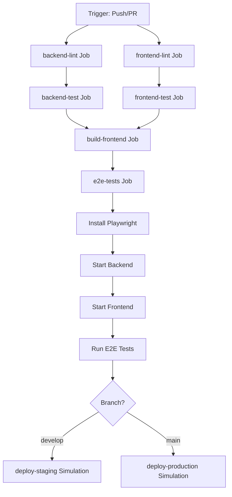
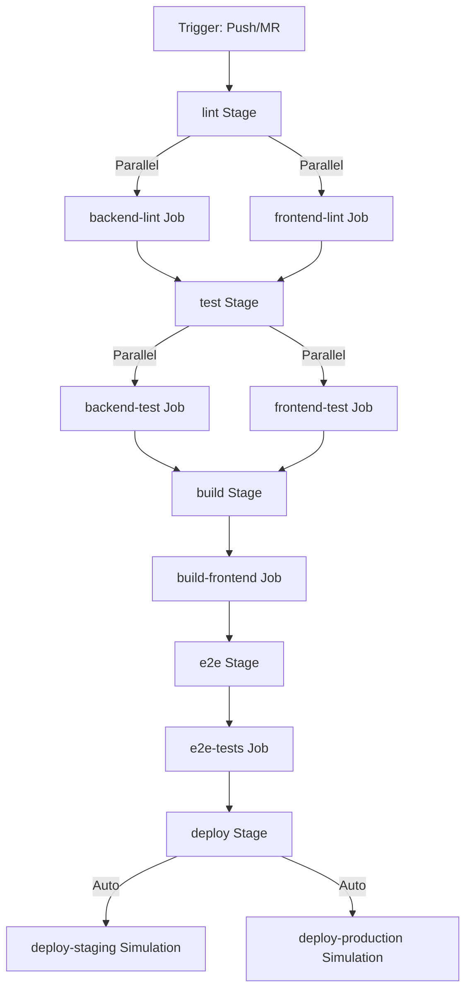
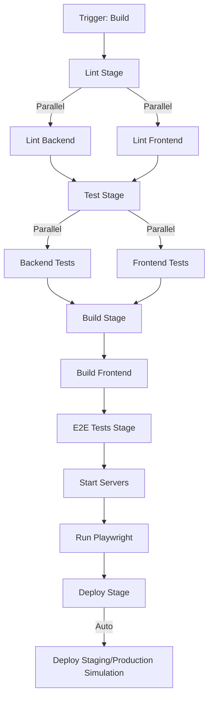

5. Technische Umsetzung

5.1 Beschreibung der Beispielanwendung

Die Beispielanwendung ist eine Web-basierte BMI-Rechner-Anwendung, die als Evaluierungsgrundlage für die CI/CD-Plattform-Vergleiche dient. Die Anwendung besteht aus einem React-basierten Frontend und einem Express.js-basierten Backend mit SQLite-Datenbank. Diese Architektur ermöglicht eine realistische Evaluierung der CI/CD-Pipelines, da sie typische Anforderungen moderner Web-Anwendungen abdeckt: Frontend-Builds, Backend-Tests, Datenbankoperationen und End-to-End-Tests.

Die folgende Abbildung zeigt die Gesamtarchitektur der Anwendung:

Die Anwendung implementiert eine vollständige Benutzerauthentifizierung mit Registrierung und Login, BMI-Berechnung und -Speicherung, Statistiken und Visualisierungen sowie Benutzerprofilverwaltung. Diese Funktionalitäten erfordern verschiedene Arten von Tests: Unit-Tests für Frontend-Komponenten, Integrationstests für Backend-APIs, Datenbanktests und End-to-End-Tests mit Playwright. Die Anwendung dient somit als repräsentative Testumgebung für die Evaluierung der drei CI/CD-Plattformen.

5.1.1 Frontend

Das Frontend der BMI-Anwendung basiert auf React 19.1.1 und verwendet React Router für die Navigation. Die Anwendung ist als Single-Page-Application (SPA) konzipiert und nutzt moderne React-Features wie Hooks für State-Management und Context API für die Authentifizierung. Die Frontend-Architektur folgt einer klaren Komponentenstruktur mit wiederverwendbaren Komponenten und Seitenkomponenten.

Die Anwendung besteht aus sieben Hauptseiten: Login, Registrierung, Dashboard, BMI-Rechner, Statistiken, Programme und Profil. Jede Seite ist als separate Komponente implementiert und nutzt React Router für die Navigation. Die Authentifizierung wird über einen AuthContext verwaltet, der den Authentifizierungsstatus und Benutzerdaten global bereitstellt. Geschützte Routen werden durch eine ProtectedRoute-Komponente abgesichert, die nicht-authentifizierte Benutzer zur Login-Seite umleitet.

Die BMI-Rechner-Seite ermöglicht es Benutzern, ihre Körpergröße, Gewicht und Alter einzugeben. Die Berechnung erfolgt im Backend, wobei das Frontend die Eingaben validiert und die Ergebnisse anzeigt. Die Dashboard-Seite zeigt eine Übersicht über die BMI-Statistiken des Benutzers, einschließlich des aktuellen BMI-Werts, des Durchschnitts und der letzten Einträge. Die Seite wurde mit visuellen Elementen wie Bildern in der Header-Sektion und in den Aktionskarten verbessert, um die Benutzerfreundlichkeit zu erhöhen. Die Statistiken-Seite verwendet Recharts für die Visualisierung der BMI-Verlaufshistorie in Form von Diagrammen. Die Diagramme wurden mit Achsenbeschriftungen (X-Achse: Datum, Y-Achse: BMI bzw. Gewicht) versehen, um die Orientierung für Benutzer zu verbessern. Die Y-Achsen passen sich dynamisch an die Daten an mit einer 10%igen Marge, um sicherzustellen, dass die Kurven nicht außerhalb der Achsen verlaufen. Die BMI-Y-Achse zeigt natürliche ganze Zahlen ohne Dezimalstellen für bessere Lesbarkeit. Die Programme-Seite bietet personalisierte Trainings- und Ernährungsprogramme basierend auf dem aktuellen BMI-Status des Benutzers. Die Programme werden dynamisch basierend auf dem aktuellen BMI-Wert des Benutzers ausgewählt, wobei verschiedene Programme für Untergewicht, Normalgewicht, Übergewicht und Adipositas bereitgestellt werden. Jedes Programm enthält Informationen über Typ, Titel, Beschreibung, Dauer, Schwierigkeitsgrad und spezifische Übungen oder Ernährungsempfehlungen. Die Programme-Seite wurde mit Bildern in den Programm-Karten und einer integrierten YouTube-Workout-Video-Sektion am Ende der Seite erweitert, um Benutzer zu motivieren. Die Programme-Seite ruft die aktuellen BMI-Daten über die Stats-API ab und filtert die Programme entsprechend dem BMI-Status. Benutzer können Programme starten, wobei eine Erfolgsmeldung angezeigt wird, wenn ein Programm erfolgreich gestartet wurde.

Die Anwendung nutzt Vite als Build-Tool, was schnelle Entwicklung und optimierte Produktions-Builds ermöglicht. Vite bietet Hot Module Replacement (HMR) für schnelle Entwicklungszyklen und optimierte Bundle-Größen für Produktions-Builds. Die Frontend-Tests verwenden Vitest als Test-Framework, das kompatibel mit Vite ist und schnelle Test-Ausführung ermöglicht. Die Tests decken Komponenten-Rendering, Benutzerinteraktionen und API-Integration ab.

Die Frontend-Komponenten sind mit Testing Library getestet, was eine benutzerorientierte Test-Strategie ermöglicht. Die Testabdeckung umfasst acht Testdateien: Login.test.jsx, Register.test.jsx, Dashboard.test.jsx, BmiCalculator.test.jsx, Statistics.test.jsx, Profile.test.jsx, Programs.test.jsx und Accessibility.test.jsx für Accessibility-Tests. Die Tests prüfen, ob Komponenten korrekt gerendert werden, ob Benutzerinteraktionen funktionieren und ob API-Aufrufe korrekt behandelt werden. Mocking wird für API-Aufrufe verwendet, um Tests isoliert und schnell auszuführen. Die Testabdeckung erreicht 97,1% für das Frontend und umfasst alle Hauptkomponenten und kritischen Benutzerflows. Die Tests wurden erweitert, um verschiedene BMI-Status (Untergewicht, Normalgewicht, Übergewicht, Adipositas), Fehlerbehandlung, Netzwerkfehler und die neue Video-Sektion abzudecken.

Die Anwendung verwendet CSS für das Styling, wobei jede Komponente ihre eigenen Styles hat. Die Navigation wird durch eine Navigation-Komponente bereitgestellt, die auf allen geschützten Seiten angezeigt wird. Die Anwendung ist responsive gestaltet und funktioniert auf verschiedenen Bildschirmgrößen. Die Frontend-Architektur ist modular aufgebaut, was Wartbarkeit und Erweiterbarkeit gewährleistet. Die Anwendung verwendet ein benutzerdefiniertes SVG-Favicon, das ein BMI-Messgerät darstellt und die visuelle Identität der Anwendung stärkt. Die Favicon-Implementierung nutzt moderne Browser-Caching-Strategien mit Versionsparametern, um Cache-Invalidierung zu gewährleisten.

5.1.2 Backend

Das Backend der BMI-Anwendung basiert auf Express.js 5.1.0 und Node.js 20. Die Backend-Architektur folgt einem RESTful API-Design mit klarer Trennung von Routen, Middleware und Datenbanklogik. Die Anwendung verwendet SQLite als Datenbank, was eine einfache Einrichtung und Wartung ermöglicht, während gleichzeitig typische Datenbankoperationen abgedeckt werden.

Die Datenbankstruktur umfasst drei Haupttabellen: users, bmi_records und weight_goals. Die users-Tabelle speichert Benutzerinformationen einschließlich Name, E-Mail, gehashtes Passwort, Geschlecht, Geburtsdatum und Größe. Die bmi_records-Tabelle speichert alle BMI-Berechnungen mit Verknüpfung zum Benutzer über eine Foreign Key-Beziehung. Die weight_goals-Tabelle ermöglicht es Benutzern, Gewichtsziele zu setzen und zu verfolgen.

Die Authentifizierung erfolgt über JSON Web Tokens (JWT), die bei erfolgreicher Registrierung oder Anmeldung generiert werden. Die JWT-Tokens enthalten Benutzerinformationen und werden für die Authentifizierung bei geschützten API-Endpunkten verwendet. Die Passwörter werden mit bcrypt gehasht, bevor sie in der Datenbank gespeichert werden, was Sicherheit gewährleistet.

Die API-Endpunkte sind in separate Route-Dateien organisiert: authRoutes für Authentifizierung, bmiRoutes für BMI-Berechnungen, statsRoutes für Statistiken und testRoutes für Test-Endpunkte. Die Authentifizierungs-Routen umfassen POST /api/auth/register für Benutzerregistrierung, POST /api/auth/login für Anmeldung, GET /api/auth/me für Benutzerinformationen und PUT /api/auth/profile für Profilaktualisierung. Die BMI-Routen umfassen POST /api/bmi für BMI-Berechnung und -Speicherung, GET /api/history für Historie-Abruf und PUT /api/bmi/:id für Aktualisierung von BMI-Einträgen. Die Statistiken-Routen umfassen GET /api/stats/summary für Zusammenfassung der BMI-Statistiken und GET /api/stats/detailed für detaillierte Daten für Diagramme. Zusätzlich wurden neue Routen für Programmverwaltung implementiert: POST /api/programs/start zum Starten eines Programms für einen Benutzer und GET /api/programs zum Abrufen aller Programme eines Benutzers. Diese Routen ermöglichen es Benutzern, personalisierte Trainings- und Ernährungsprogramme zu starten und zu verfolgen. Jede Route-Datei exportiert eine Funktion, die die Datenbankinstanz als Parameter erhält, was Dependency Injection ermöglicht und Tests erleichtert. Die Middleware requireAuth wird für geschützte Endpunkte verwendet, um die Authentifizierung zu überprüfen.

Die BMI-Berechnung erfolgt im Backend nach der Standardformel: BMI = Gewicht (kg) / (Größe (m))². Das Backend validiert Eingaben, berechnet den BMI-Wert und kategorisiert das Ergebnis in Untergewicht, Normalgewicht, Übergewicht oder Adipositas. Die Berechnung wird in der Datenbank gespeichert und mit dem authentifizierten Benutzer verknüpft.

Die Backend-Tests verwenden Jest als Test-Framework und Supertest für HTTP-Assertionen. Die Testabdeckung umfasst sieben Testsuites: auth.test.js für Authentifizierung, bmi.test.js für BMI-Berechnungen, stats.test.js für Statistiken, calculateBMI.test.js für die BMI-Berechnungsfunktion, validation.test.js für Eingabevalidierung, security.test.js für Sicherheitstests und performance.test.js für umfassende Performance-Tests. Die Performance-Tests wurden erheblich erweitert und umfassen nun 18 Tests, die Load-Testing (20 sequenzielle und parallele Anfragen), Stress-Testing (100 BMI-Records, 50 gleichzeitige Anfragen), Scalability-Testing (verschiedene Datenvolumina und Parallelisierungsgrade) sowie detaillierte Performance-Metriken (Durchsatz, Latenz P50/P95/P99) abdecken. Die Tests decken alle API-Endpunkte ab, einschließlich Authentifizierung, BMI-Berechnung, Statistiken, Programmverwaltung und Fehlerbehandlung. Die Tests verwenden in-memory SQLite-Datenbanken, um Isolation zu gewährleisten und Test-Performance zu optimieren. Die Testabdeckung umfasst Unit-Tests für einzelne Funktionen und Integrationstests für API-Endpunkte. Die Testabdeckung wurde systematisch verbessert, um alle kritischen Pfade und Edge-Cases abzudecken.

Die Backend-Architektur unterstützt CORS für Frontend-Kommunikation und verwendet Express Middleware für JSON-Parsing und Fehlerbehandlung. Die Anwendung startet einen HTTP-Server auf Port 3000 und initialisiert die Datenbank beim Start. Die Datenbankinitialisierung erstellt die Tabellen, falls sie nicht existieren, und konfiguriert SQLite für optimale Performance mit WAL-Modus und busy_timeout für bessere Concurrency-Handhabung.

5.2 Einrichtung der CI/CD-Pipelines

Die CI/CD-Pipelines für die drei Plattformen wurden so konfiguriert, dass sie identische Aufgaben ausführen, um eine faire Vergleichsbasis zu gewährleisten. Alle Pipelines durchlaufen die gleichen Stages: Lint, Test, Build, E2E-Tests und Deploy. Die Konfigurationen wurden sorgfältig angepasst, um funktionale Äquivalenz zu erreichen, während plattformspezifische Syntax und Features genutzt werden. Um eine vollständig faire Vergleichsbasis zu gewährleisten, wurden die Docker-Build-Stages in allen drei Pipelines deaktiviert, da Docker-in-Docker auf dem verwendeten GitLab CI Shared Runner nicht verfügbar war. Die Deploy-Stages wurden in allen drei Plattformen als identische Simulationen implementiert, die nur Echo-Befehle ausführen, um eine faire Vergleichsbasis zu gewährleisten und Infrastruktur-Abhängigkeiten zu eliminieren.

Die folgende Abbildung zeigt die gemeinsame Pipeline-Struktur, die von allen drei Plattformen implementiert wird:

Die Pipelines sind so strukturiert, dass sie bei jedem Push auf die Haupt- und Entwicklungsbranches sowie bei Pull Requests ausgelöst werden. Parallele Ausführung wird für Lint- und Test-Jobs genutzt, um die Gesamtausführungszeit zu reduzieren. Die E2E-Tests werden nach dem Frontend-Build ausgeführt und erfordern laufende Backend- und Frontend-Server. Die Deploy-Stages sind als Simulationen implementiert, da keine tatsächliche Deployment-Infrastruktur vorhanden ist.

5.2.1 Pipeline in GitHub Actions

Die GitHub Actions Pipeline wird durch eine YAML-Datei im `.github/workflows/` Verzeichnis definiert. Die Workflow-Definition verwendet die GitHub Actions Syntax mit Jobs, Steps und Actions. Die Pipeline besteht aus sechs Jobs: backend-lint, frontend-lint, backend-test, frontend-test, build-frontend, e2e-tests und deploy-staging/production. Die Docker-Build-Jobs wurden deaktiviert, um eine faire Vergleichsbasis mit GitLab CI zu gewährleisten, da Docker-in-Docker auf dem verwendeten GitLab CI Shared Runner nicht verfügbar war.

Die Lint-Jobs führen ESLint auf Backend- und Frontend-Code aus, um Code-Qualität sicherzustellen. Die Test-Jobs installieren Abhängigkeiten mit npm ci, führen Tests aus und laden Test-Ergebnisse als Artifacts hoch. Die Build-Jobs kompilieren das Frontend mit Vite und erstellen Produktions-Builds. Die E2E-Tests installieren Playwright-Browser, starten Backend- und Frontend-Server und führen End-to-End-Tests aus.

Die GitHub Actions Pipeline nutzt vorgefertigte Actions aus dem Marketplace, wie actions/checkout@v4 für Repository-Checkout, actions/setup-node@v4 für Node.js-Setup und actions/upload-artifact@v4 für Artifact-Upload. Die Pipeline verwendet Caching-Mechanismen für npm-Abhängigkeiten, um Build-Zeiten zu reduzieren. Die Docker-Build-Jobs wurden deaktiviert und als Kommentare beibehalten, um eine faire Vergleichsbasis mit den anderen Plattformen zu gewährleisten.

Die Pipeline-Konfiguration nutzt GitHub-spezifische Features wie Matrix-Builds, Environment-Variablen und Secrets-Management. Die Deploy-Jobs sind bedingt auf bestimmte Branches und verwenden GitHub Environments für Staging- und Produktions-Deployments. Die Pipeline-Logs sind direkt in der GitHub-Weboberfläche verfügbar, und Test-Ergebnisse werden als Artifacts gespeichert.

Die folgende Abbildung zeigt die GitHub Actions Pipeline-Struktur im Detail:

5.2.2 Pipeline in GitLab CI

Die GitLab CI Pipeline wird durch eine `.gitlab-ci.yml` Datei im Repository-Root definiert. Die Pipeline-Konfiguration verwendet GitLab CI Syntax mit Stages, Jobs und Scripts. Die Pipeline besteht aus fünf Stages: lint, test, build, e2e und deploy. Jeder Stage enthält einen oder mehrere Jobs, die parallel oder sequenziell ausgeführt werden können.

Die GitLab CI Pipeline verwendet Docker-Images für die Job-Ausführung, wobei node:20 als Basis-Image für alle Jobs verwendet wird. Die Pipeline nutzt GitLab CI Caching-Mechanismen für npm-Abhängigkeiten, um Build-Zeiten zu optimieren. Die Jobs verwenden before_script für gemeinsame Setup-Schritte wie Abhängigkeitsinstallation.

Die Lint- und Test-Jobs sind parallel innerhalb ihrer Stages ausgeführt, was die Gesamtausführungszeit reduziert. Die Build-Jobs erstellen Frontend-Artefakte, die als GitLab Artifacts gespeichert werden. Die E2E-Tests starten Backend- und Frontend-Server im Hintergrund, warten auf deren Verfügbarkeit und führen dann Playwright-Tests aus.

Die GitLab CI Pipeline unterstützt Coverage-Reports, die automatisch in der GitLab-Weboberfläche angezeigt werden. Die Artifacts werden für sieben Tage gespeichert und können über die GitLab-Weboberfläche heruntergeladen werden. Die Docker-Build-Jobs sind in der aktuellen Konfiguration deaktiviert, da Docker-in-Docker auf dem verwendeten Shared Runner nicht verfügbar ist. Dies stellt eine Limitation der Testumgebung dar, nicht der Plattform selbst.

Die Deploy-Jobs sind automatisch konfiguriert und werden auf bestimmten Branches ausgeführt (develop für Staging, main für Production). Die Jobs verwenden alpine:latest als minimales Image und simulieren Deployment-Befehle mit identischen Echo-Nachrichten wie in den anderen Plattformen, um eine faire Vergleichsbasis zu gewährleisten. Die Pipeline-Konfiguration nutzt GitLab-spezifische Features wie Environment-Management, Coverage-Parsing und Artifact-Management.

Die folgende Abbildung zeigt die GitLab CI Pipeline-Struktur:

5.2.3 Pipeline in Jenkins

Die Jenkins Pipeline wird durch eine Jenkinsfile im Repository-Root definiert, die in Groovy-Syntax geschrieben ist. Die Pipeline verwendet die Declarative Pipeline Syntax, die eine strukturierte und lesbare Konfiguration ermöglicht. Die Pipeline besteht aus sechs Stages: Lint, Test, Build, E2E Tests, Docker Build und Deploy.

Die Jenkins Pipeline nutzt einen agent any, was bedeutet, dass sie auf jedem verfügbaren Jenkins-Agent ausgeführt werden kann. Die Pipeline verwendet Environment-Variablen für Node.js-Version und andere Konfigurationen. Die Pipeline-Optionen umfassen Build-Discarder für Log-Rotation, Timeout für Pipeline-Ausführung und Timestamps für Log-Zeitstempel.

Die Lint- und Test-Stages verwenden parallel-Blöcke, um Backend- und Frontend-Jobs gleichzeitig auszuführen. Die Jobs verwenden dir-Blöcke, um in spezifischen Verzeichnissen zu arbeiten, und sh-Befehle für Shell-Kommandos. Die Test-Jobs verwenden junit für Test-Report-Parsing und archiveArtifacts für Coverage-Reports.

Die Build-Stage kompiliert das Frontend und archiviert die Build-Artefakte. Die E2E-Tests-Stage installiert Abhängigkeiten, startet Backend- und Frontend-Server im Hintergrund, wartet auf deren Verfügbarkeit und führt Playwright-Tests aus. Die Prozess-Verwaltung erfolgt über PID-Dateien, um Server nach Test-Ausführung ordnungsgemäß zu beenden.

Die Docker-Build-Stage ist bedingt auf main- und develop-Branches und verwendet try-catch-Blöcke für Fehlerbehandlung. Die Stage versucht, Docker-Registry-Credentials zu verwenden, fällt aber auf localhost:5000 zurück, wenn keine Credentials konfiguriert sind. Die Docker-Builds sind optional und blockieren die Pipeline nicht bei Fehlern.

Die Deploy-Stage führt automatisch Deployment-Simulationen aus, die identische Echo-Nachrichten wie in den anderen Plattformen verwenden, um eine faire Vergleichsbasis zu gewährleisten. Die Stage unterscheidet zwischen Staging- und Produktions-Deployments basierend auf der Branch. Die Pipeline verwendet post-Blöcke für Cleanup-Operationen und Notifications. Die Docker-Build-Stage wurde deaktiviert und als Kommentare beibehalten, um eine faire Vergleichsbasis zu gewährleisten.

Die Jenkins Pipeline bietet umfangreiche Logging- und Reporting-Funktionen über die Jenkins-Weboberfläche. Test-Ergebnisse werden als JUnit-Reports angezeigt, und Artifacts können über die Weboberfläche heruntergeladen werden. Die Pipeline-Konfiguration ist flexibel und kann leicht angepasst werden, erfordert jedoch mehr Programmierkenntnisse als YAML-basierte Konfigurationen.

Die folgende Abbildung zeigt die Jenkins Pipeline-Struktur:

Die drei Pipeline-Konfigurationen sind vollständig funktional äquivalent und führen exakt die gleichen Aufgaben aus: Lint (Backend und Frontend parallel), Test (Backend und Frontend parallel), Build (Frontend), E2E-Tests und Deploy (Simulation). Die Docker-Build-Stages wurden in allen drei Plattformen deaktiviert, um eine faire Vergleichsbasis zu gewährleisten. Die Deploy-Stages sind in allen drei Plattformen identisch implementiert (automatische Simulation mit Echo-Befehlen), was eine vollständig faire Vergleichsbasis für die Performance-Evaluierung gewährleistet. Die Konfigurationen dienen als Grundlage für die Performance-Evaluierung und den Vergleich der drei CI/CD-Plattformen.

Literaturverzeichnis

Clark, M. (2022). Modern CI/CD with GitHub Actions, GitLab CI, and Jenkins. O'Reilly Media.

Chapman, J. (2022). GitHub Actions: Automate your workflow. Packt Publishing.

Laster, B. (2021). Learning GitHub Actions: Automation and integration of CI/CD with GitHub. O'Reilly Media.

Humble, J., & Farley, D. (2010). Continuous Delivery: Reliable Software Releases through Build, Test, and Deployment Automation. Addison-Wesley Professional.

Wolf, K. (2014). Continuous Integration: Improving Software Quality and Reducing Risk. Addison-Wesley Professional.

Singh, A. (2021). DevOps Metrics: Measuring What Matters. Apress.

JetBrains. (2023). The State of Developer Ecosystem 2023. JetBrains.

JetBrains. (2025). The State of Developer Ecosystem 2025. JetBrains.

