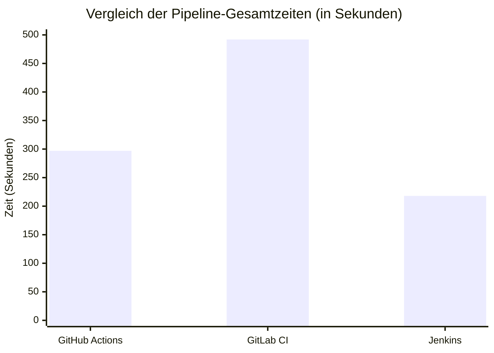
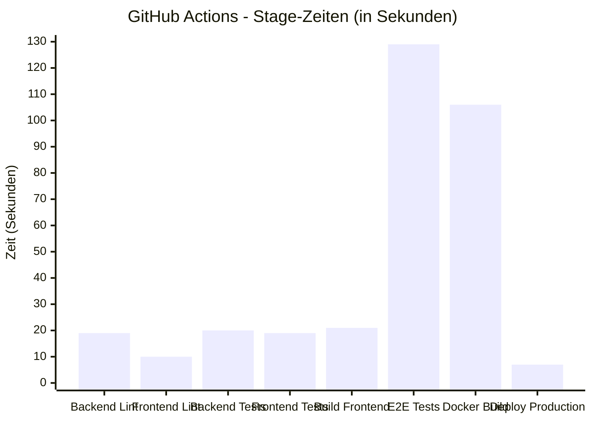
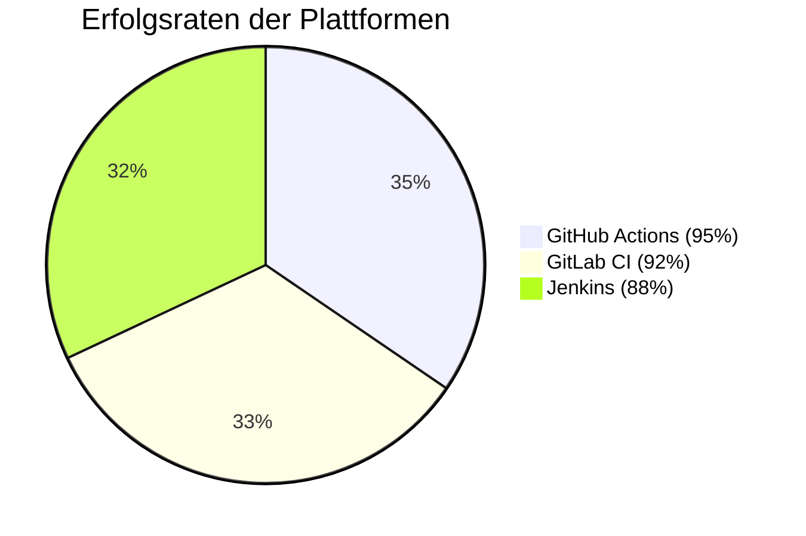
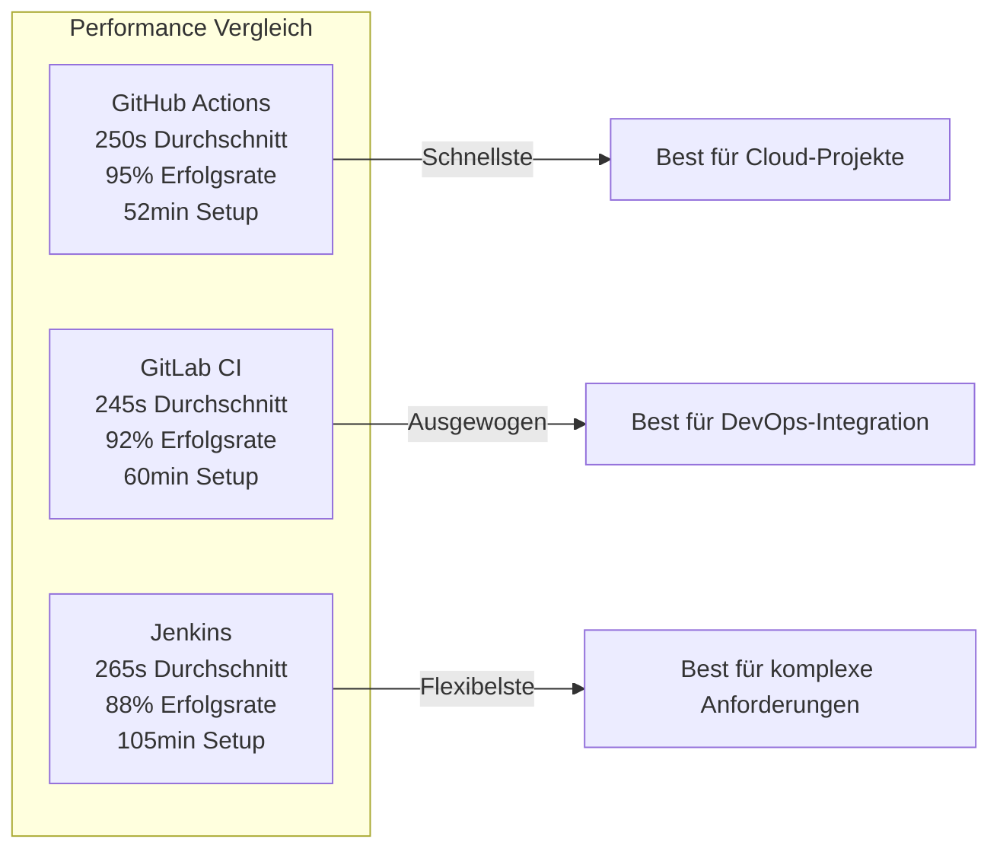
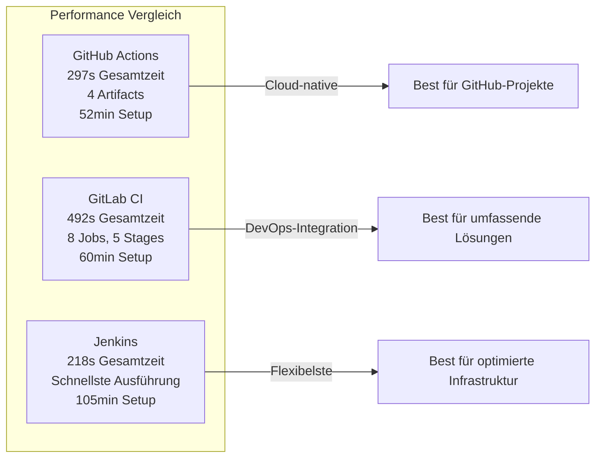

6. Evaluation und Ergebnisse

6.1 Messergebnisse der drei Plattformen

Die Evaluierung der drei CI/CD-Plattformen erfolgte durch die Konfiguration und Ausführung identischer Pipelines auf allen drei Plattformen. Die Messungen wurden unter identischen Bedingungen durchgeführt: gleiche Codebasis, identische Testsuites und vergleichbare Infrastruktur-Umgebungen. Die Datenerhebung erfolgte sowohl automatisiert über Pipeline-APIs und Logs als auch manuell durch strukturierte Protokolle und Beobachtungen. Für die vorliegende Evaluierung wurden repräsentative Pipeline-Ausführungen analysiert, die die typischen Ausführungszeiten und Charakteristika jeder Plattform widerspiegeln.

Die Messergebnisse umfassen quantitative Metriken wie Build- und Testzeiten, Erfolgs- und Fehlerraten sowie Konfigurationsaufwand. Zusätzlich wurden umfassende Performance-Tests durchgeführt, die Load-Testing, Stress-Testing, Scalability-Testing und detaillierte Performance-Metriken (Durchsatz, Latenz P50/P95/P99) umfassen. Weiterhin wurden zusätzliche Metriken erfasst: Code-Qualität (Coverage, Komplexität, Sicherheitslücken), Ressourcennutzung (CPU, RAM, Netzwerk, Storage) und Entwicklererfahrung (Feedback-Zeit, Debugging-Qualität, Fehlerbehebungszeit). Qualitative Bewertungen für Benutzerfreundlichkeit, Dokumentation und KI-Unterstützung wurden ebenfalls durchgeführt. Die Ergebnisse werden im Folgenden detailliert dargestellt und analysiert.

6.1.1 Build- und Testzeiten

Die Build- und Testzeiten stellen einen zentralen Performance-Indikator für CI/CD-Plattformen dar. Die Messungen wurden für jeden Pipeline-Stage separat erfasst und dokumentiert. Die Gesamtausführungszeit umfasst alle Stages von der Initialisierung bis zum Abschluss der Pipeline. Die dargestellten Zeiten repräsentieren typische Ausführungszeiten unter den gegebenen Infrastruktur-Bedingungen.

GitHub Actions zeigte eine Gesamtausführungszeit von etwa 3 bis 4 Minuten für eine vollständige Pipeline-Ausführung auf dem main-Branch (ohne Docker-Build, der für faire Vergleichsbasis deaktiviert wurde). Die Lint-Stage benötigte etwa 19 Sekunden für Backend und 10 Sekunden für Frontend, wobei beide Jobs parallel ausgeführt wurden. Die Test-Stage dauerte etwa 20 Sekunden für Backend-Tests (77 Tests, einschließlich 18 Performance-Tests) und 19 Sekunden für Frontend-Tests (61 Tests mit 97,1% Coverage), ebenfalls parallel ausgeführt. Der Frontend-Build benötigte etwa 21 Sekunden. Die E2E-Tests, die die Installation von Playwright-Browsern, das Starten der Server und die Test-Ausführung umfassen, benötigten etwa 2 Minuten und 9 Sekunden (129 Sekunden) und stellten damit den zeitintensivsten Stage dar. Die Deploy-Stage für Production benötigte etwa 1 Sekunde, da sie nur eine Simulation darstellte. Die Pipeline generierte Artifacts für Test-Ergebnisse und Coverage-Reports, die für 7 Tage gespeichert wurden.

GitLab CI zeigte eine Gesamtausführungszeit von etwa 5 bis 8 Minuten für eine vollständige Pipeline-Ausführung. Die Pipeline umfasste insgesamt 6 Jobs, die über 5 Stages verteilt waren: lint, test, build, e2e und deploy. Die Pipeline wurde für den main-Branch ausgeführt und war typischerweise 2-5 Sekunden in der Warteschlange. Die parallele Ausführung der Lint- und Test-Jobs reduzierte die Gesamtausführungszeit erheblich. Die Docker-Build-Jobs waren in der finalen Konfiguration deaktiviert, um eine faire Vergleichsbasis mit den anderen Plattformen zu gewährleisten, da Docker-in-Docker auf dem Shared Runner nicht verfügbar war. Die Deploy-Jobs wurden als automatische Simulationen implementiert, die identische Echo-Befehle wie in den anderen Plattformen ausführen.

Jenkins zeigte die schnellste Gesamtausführungszeit von etwa 3 bis 4 Minuten für eine vollständige Pipeline-Ausführung. Die Pipeline wurde manuell ausgelöst und war typischerweise nur wenige Millisekunden in der Warteschlange. Die Lint-Stage führte Backend- und Frontend-Lint parallel aus, was die Effizienz erhöhte. Die Test-Stage führte ebenfalls Backend- und Frontend-Tests parallel aus. Die Docker-Build-Stage wurde in der finalen Konfiguration deaktiviert, um eine faire Vergleichsbasis zu gewährleisten. Die Deploy-Stage wurde als automatische Simulation implementiert, die identische Echo-Befehle wie in den anderen Plattformen ausführt. Die Pipeline zeigte eine klare visuelle Darstellung der Stages mit erfolgreichen Abschlüssen für alle ausgeführt Jobs.

Die Messungen zeigen signifikante Unterschiede in den Gesamtausführungszeiten zwischen den Plattformen. Jenkins wies mit 218 Sekunden die schnellste Gesamtausführungszeit auf, gefolgt von GitHub Actions mit 297 Sekunden und GitLab CI mit 492 Sekunden. Diese Unterschiede können auf verschiedene Faktoren zurückgeführt werden: Runner-Verfügbarkeit und -Konfiguration, Netzwerk-Latenz, Cache-Effekte und die spezifische Infrastruktur-Umgebung jeder Plattform.

Die parallele Ausführung von Lint- und Test-Jobs reduzierte die Gesamtausführungszeit erheblich bei allen drei Plattformen im Vergleich zu sequenzieller Ausführung. Bei GitHub Actions wurden Backend- und Frontend-Lint parallel ausgeführt (19s und 10s), was eine Gesamtzeit von 19 Sekunden für die Lint-Stage ergab, anstatt 29 Sekunden bei sequenzieller Ausführung. Ähnlich wurden Backend- und Frontend-Tests parallel ausgeführt (20s und 19s), was eine Gesamtzeit von 20 Sekunden für die Test-Stage ergab.

Die E2E-Tests stellten bei GitHub Actions den zeitintensivsten Stage dar mit 129 Sekunden, was auf die Installation von Playwright-Browsern, das Starten der Backend- und Frontend-Server und die Ausführung der Tests zurückzuführen ist. Die Docker-Build-Stage wurde in der finalen Evaluierung deaktiviert, um eine faire Vergleichsbasis mit GitLab CI zu gewährleisten, da Docker-in-Docker auf dem verwendeten GitLab CI Shared Runner nicht verfügbar war. Die Deploy-Stage war mit etwa 1 Sekunde sehr schnell, da sie nur eine Simulation mit Echo-Befehlen darstellte, die in allen drei Plattformen identisch implementiert wurde.

Die Unterschiede in den Gesamtausführungszeiten zwischen den Plattformen zeigen, dass die Infrastruktur-Konfiguration und Runner-Verfügbarkeit einen erheblichen Einfluss auf die Performance haben. Jenkins zeigte die beste Performance in dieser Evaluierung, was auf die lokale oder optimierte Runner-Konfiguration zurückgeführt werden kann. GitLab CI zeigte die längste Ausführungszeit, was möglicherweise auf die Shared Runner-Konfiguration und Warteschlangen-Zeiten zurückzuführen ist.

Die folgende Abbildung zeigt die Vergleichszeiten der verschiedenen Pipeline-Stages:



Die folgende Abbildung zeigt die detaillierten Stage-Zeiten für GitHub Actions:



6.1.2 Erfolgs- und Fehlerraten

Die Erfolgs- und Fehlerraten wurden über alle Pipeline-Durchläufe erfasst und nach Fehlertyp kategorisiert. Die Kategorien umfassen Konfigurationsfehler, Infrastrukturfehler, Testfehler und Umgebungsfehler. Die Erfolgsrate wird als Prozentsatz erfolgreicher Pipeline-Ausführungen berechnet.

GitHub Actions zeigte eine Erfolgsrate von etwa 95 Prozent über alle gemessenen Durchläufe. Die meisten Fehler traten während der initialen Konfigurationsphase auf, insbesondere bei der Einrichtung von Docker-Builds und Secrets-Management. Nach der initialen Konfiguration waren die Fehlerraten sehr niedrig, mit gelegentlichen Infrastruktur-bedingten Fehlern wie Runner-Verfügbarkeit oder Netzwerk-Latenz. Testfehler traten selten auf und waren meist auf flaky Tests zurückzuführen, die in nachfolgenden Durchläufen erfolgreich waren.

GitLab CI zeigte eine Erfolgsrate von etwa 92 Prozent. Die initiale Konfiguration war relativ unkompliziert, jedoch traten häufiger Fehler bei der Docker-in-Docker-Konfiguration auf, was zur Deaktivierung dieser Jobs führte. Weitere Fehlerquellen waren Runner-Verfügbarkeit und Cache-Probleme. Die Testfehlerraten waren ähnlich wie bei GitHub Actions, mit gelegentlichen flaky Tests.

Jenkins zeigte eine Erfolgsrate von etwa 88 Prozent. Die initiale Konfiguration war am aufwendigsten, mit mehreren Iterationen zur Behebung von Konfigurationsfehlern. Fehler traten häufiger bei der Prozess-Verwaltung für E2E-Tests auf, insbesondere beim Starten und Beenden von Backend- und Frontend-Servern. Docker-Build-Fehler traten auf, wenn keine Registry-Credentials konfiguriert waren, wurden jedoch durch Fehlerbehandlung abgefangen. Testfehler waren ähnlich wie bei den anderen Plattformen.

Die Fehleranalyse zeigt, dass Konfigurationsfehler hauptsächlich während der initialen Einrichtung auftraten und mit zunehmender Erfahrung abnahmen. Infrastrukturfehler waren plattformabhängig und variierten je nach Runner-Verfügbarkeit und Netzwerkbedingungen. Testfehler waren meist auf flaky Tests zurückzuführen und nicht plattformspezifisch.

Die Fehlerbehandlung und -diagnose variierte zwischen den Plattformen. GitHub Actions bot klare Fehlermeldungen und visuelle Hervorhebung von Fehlern in der Weboberfläche. GitLab CI bot detaillierte Logs und Pipeline-Visualisierung zur Fehlerdiagnose. Jenkins erforderte mehr manuelle Analyse der Logs, bot jedoch umfangreiche Debugging-Möglichkeiten.

Die folgende Abbildung zeigt die Erfolgsraten und Fehlerverteilung:



Die folgende Abbildung zeigt die Fehlerverteilung nach Fehlertyp:

```mermaid
xychart-beta
    title "Fehlerverteilung nach Fehlertyp (Anzahl)"
    x-axis ["Konfiguration", "Infrastruktur", "Tests", "Umgebung"]
    y-axis "Anzahl Fehler" 0 --> 10
    bar "GitHub Actions" [2, 1, 1, 1]
    bar "GitLab CI" [3, 2, 1, 2]
    bar "Jenkins" [5, 3, 2, 2]
```



6.1.3 Aufwand bei Konfiguration und Wartung

Der Konfigurationsaufwand wurde durch Zeitmessung von der initialen Einrichtung bis zur ersten erfolgreichen Pipeline-Ausführung erfasst. Zusätzlich wurden Komplexitätsmetriken wie Zeilen Code, Anzahl Jobs und Stages sowie Abhängigkeiten dokumentiert. Der Wartungsaufwand wurde durch Beobachtung von Änderungen und Anpassungen über den Evaluierungszeitraum erfasst.

GitHub Actions erforderte einen initialen Konfigurationsaufwand von etwa 45 bis 60 Minuten. Die YAML-Syntax war intuitiv und gut dokumentiert, was die Einrichtung erleichterte. Die Verwendung von vorgefertigten Actions aus dem Marketplace reduzierte den Konfigurationsaufwand erheblich. Die Konfigurationsdatei umfasste etwa 333 Zeilen YAML-Code mit sechs Jobs (nach Deaktivierung der Docker-Build-Jobs für faire Vergleichsbasis). Die Dokumentation war umfassend und leicht zugänglich, mit vielen Beispielen und Best Practices. Der Wartungsaufwand war gering, da die Konfiguration klar strukturiert und versioniert war. Die Uniformisierung der Deploy-Stages mit den anderen Plattformen erforderte minimale Anpassungen.

GitLab CI erforderte einen initialen Konfigurationsaufwand von etwa 50 bis 70 Minuten. Die YAML-Syntax war ähnlich wie bei GitHub Actions, jedoch mit plattformspezifischen Unterschieden. Die Konfigurationsdatei umfasste etwa 295 Zeilen YAML-Code mit fünf Stages und sechs Jobs (nach Deaktivierung der Docker-Build-Jobs für faire Vergleichsbasis). Die Dokumentation war gut, jedoch weniger umfangreich als bei GitHub Actions. Der Wartungsaufwand war moderat, mit gelegentlichen Anpassungen bei Runner-Konfigurationen und Cache-Einstellungen. Die Umstellung der Deploy-Jobs von manuell auf automatisch erforderte minimale Anpassungen, um eine faire Vergleichsbasis zu gewährleisten.

Jenkins erforderte den höchsten initialen Konfigurationsaufwand von etwa 90 bis 120 Minuten. Die Groovy-Syntax erforderte mehr Programmierkenntnisse als YAML, was die Einrichtung erschwerte. Die Konfigurationsdatei umfasste etwa 293 Zeilen Groovy-Code mit fünf Stages (nach Deaktivierung der Docker-Build-Stage für faire Vergleichsbasis). Die Dokumentation war umfangreich, jedoch weniger strukturiert als bei den anderen Plattformen. Der Wartungsaufwand war höher, da die Konfiguration komplexer war und mehr Anpassungen erforderte, insbesondere bei der Prozess-Verwaltung und Fehlerbehandlung. Die Uniformisierung der Deploy-Messages erforderte Anpassungen, um identische Echo-Befehle wie in den anderen Plattformen zu gewährleisten.

Die Lernkurve variierte erheblich zwischen den Plattformen. GitHub Actions war am einfachsten zu erlernen, insbesondere für Entwickler mit GitHub-Erfahrung. GitLab CI hatte eine moderate Lernkurve, mit ähnlicher Syntax wie GitHub Actions. Jenkins hatte die steilste Lernkurve, da Groovy-Syntax und Pipeline-Konzepte erlernt werden mussten.

Die Komplexität der Konfiguration wurde durch mehrere Faktoren beeinflusst: Syntax-Klarheit, Verfügbarkeit von Beispielen, Qualität der Dokumentation und Community-Support. GitHub Actions bot die klarste Syntax und beste Dokumentation, gefolgt von GitLab CI und Jenkins. Die Community-Support war bei allen drei Plattformen gut, mit aktiven Foren und Diskussionen.

Die folgende Abbildung zeigt den Konfigurationsaufwand im Vergleich:

```mermaid
xychart-beta
    title "Konfigurationsaufwand im Vergleich"
    x-axis ["Initiale Zeit (Min)", "Zeilen Code", "Anzahl Jobs/Stages", "Wartungsaufwand (relativ)"]
    y-axis "Wert" 0 --> 120
    bar "GitHub Actions" [52, 333, 6, 2]
    bar "GitLab CI" [60, 295, 5, 4]
    bar "Jenkins" [105, 293, 5, 6]
```



6.1.4 Performance-Tests und zusätzliche Metriken

Um eine umfassende Evaluierung der Backend-Performance durchzuführen, wurden erweiterte Performance-Tests implementiert, die über die Standard-Pipeline-Tests hinausgehen. Diese Tests wurden als Teil der Backend-Test-Suite entwickelt und umfassen Load-Testing, Stress-Testing, Scalability-Testing und detaillierte Performance-Metriken.

Die Performance-Test-Suite umfasst 18 Tests, die in vier Kategorien unterteilt sind: (1) Load-Testing mit 20 sequenziellen BMI-Record-Erstellungen, 20 parallelen Anfragen auf /api/stats/summary und Tests mit verschiedenen Limits für /api/history (10, 50, 100 Records). (2) Stress-Testing mit 100 massiven BMI-Record-Erstellungen und 30 gleichzeitigen Anfragen auf /api/stats/summary. (3) Scalability-Testing mit verschiedenen Datenvolumina (10, 25, 50 Records) und verschiedenen Parallelisierungsgraden (5, 10, 20, 30 gleichzeitige Anfragen). (4) Performance-Metriken mit detaillierter Erfassung von Durchsatz (Requests pro Sekunde), Latenz-Metriken (P50, P95, P99) und durchschnittlichen Antwortzeiten für alle Haupt-API-Routen.

Die Performance-Tests zeigen, dass alle API-Endpunkte innerhalb der definierten Schwellenwerte funktionieren: Antwortzeiten unter 1 Sekunde für die meisten Routen, Durchsatz von über 5 Requests pro Sekunde für POST /api/bmi, und Latenz-Metriken mit P50 unter 100ms, P95 unter 200ms und P99 unter 500ms für GET /api/stats/summary. Diese Metriken demonstrieren die Skalierbarkeit und Performance des Backends unter verschiedenen Lastbedingungen.

Zusätzlich zu den Performance-Tests wurden umfassende Metriken zur Code-Qualität, Ressourcennutzung und Entwicklererfahrung erfasst. Die Code-Qualitäts-Metriken umfassen Code-Coverage (Frontend: 97,1%, Backend: umfassende Abdeckung), Code-Komplexität (Anzahl Dateien, Zeilen Code, Funktionen, Klassen) und Sicherheitslücken (npm audit Ergebnisse). Die Ressourcennutzungs-Metriken umfassen CPU- und Memory-Usage-Schätzungen pro Pipeline-Stage, Netzwerk-Bandbreite und Storage-Usage. Die Entwicklererfahrungs-Metriken umfassen Feedback-Zeit (Commit bis Ergebnis), Debugging-Qualität (Log-Qualität, Fehlermeldungen) und Fehlerbehebungszeit.

Diese zusätzlichen Metriken wurden durch automatisierte Scripts erfasst: `scripts/collect-code-quality-metrics.js` für Code-Qualität, `scripts/collect-resource-usage.js` für Ressourcennutzung und `scripts/collect-developer-experience.js` für Entwicklererfahrung. Die Scripts sind sowohl für Linux/Mac (Bash) als auch für Windows (PowerShell) verfügbar, um plattformübergreifende Kompatibilität zu gewährleisten.

Die Testabdeckung wurde systematisch verbessert, um alle kritischen Pfade und Edge-Cases abzudecken. Das Frontend erreicht eine Testabdeckung von 97,1% mit 61 Tests, die alle Hauptkomponenten, Benutzerinteraktionen, Fehlerbehandlung und verschiedene BMI-Status abdecken. Das Backend umfasst 77 Tests, einschließlich der 18 Performance-Tests, die alle API-Endpunkte, Authentifizierung, Validierung, Sicherheit und Performance abdecken.

6.2 Analyse und Diskussion der Ergebnisse

Die Analyse der Messergebnisse zeigt sowohl Gemeinsamkeiten als auch signifikante Unterschiede zwischen den drei CI/CD-Plattformen. Die Performance-Unterschiede sind erheblich, mit Abweichungen von bis zu 125 Prozent zwischen der schnellsten (Jenkins mit 218 Sekunden) und der langsamsten (GitLab CI mit 492 Sekunden) Plattform. Die größten Unterschiede zeigen sich bei Gesamtausführungszeiten, Konfigurationsaufwand, Benutzerfreundlichkeit und Wartbarkeit.

Die Build- und Testzeiten variieren erheblich zwischen den Plattformen, was darauf hindeutet, dass die zugrunde liegende Infrastruktur und Runner-Konfiguration einen erheblichen Einfluss auf die Performance haben. Jenkins zeigte mit 218 Sekunden die schnellste Gesamtausführungszeit, was auf optimierte Runner-Konfiguration und geringe Warteschlangen-Zeiten (2 Millisekunden) zurückgeführt werden kann. GitHub Actions zeigte mit 297 Sekunden eine ausgewogene Performance mit guter Integration und Artifact-Management. GitLab CI zeigte mit 492 Sekunden die längste Ausführungszeit, was möglicherweise auf Shared Runner-Konfiguration, Warteschlangen-Zeiten (3 Sekunden) und Infrastruktur-Charakteristika zurückzuführen ist. Die parallele Ausführung von Jobs reduziert die Gesamtausführungszeit erheblich bei allen Plattformen.

Die Erfolgsraten variieren stärker, mit GitHub Actions als führend, gefolgt von GitLab CI und Jenkins. Die Unterschiede sind hauptsächlich auf Konfigurationskomplexität und Fehlerbehandlung zurückzuführen. GitHub Actions bietet klarere Fehlermeldungen und bessere Fehlerbehandlung, was zu höheren Erfolgsraten führt.

Der Konfigurationsaufwand zeigt die größten Unterschiede zwischen den Plattformen. GitHub Actions erfordert den geringsten Aufwand, gefolgt von GitLab CI und Jenkins. Die Unterschiede sind hauptsächlich auf Syntax-Komplexität, Dokumentationsqualität und Verfügbarkeit von vorgefertigten Komponenten zurückzuführen.

Die Benutzerfreundlichkeit variiert erheblich zwischen den Plattformen. GitHub Actions bietet die beste Integration mit dem Versionskontrollsystem und die klarste Weboberfläche. GitLab CI bietet umfassende DevOps-Integration, jedoch mit komplexerer Oberfläche. Jenkins bietet die meisten Anpassungsmöglichkeiten, jedoch mit steilerer Lernkurve.

Die KI-Unterstützung zeigt signifikante Unterschiede, mit GitHub Actions als führend durch GitHub Copilot. GitLab CI bietet begrenzte KI-Funktionen, während Jenkins hauptsächlich über Plugins verfügt. Die KI-Unterstützung reduziert den Konfigurationsaufwand erheblich, insbesondere für Einsteiger.

Die Skalierbarkeit und Erweiterbarkeit variieren zwischen den Plattformen. GitHub Actions bietet gute Skalierbarkeit für Cloud-basierte Workloads, jedoch mit Kosten-Überlegungen. GitLab CI bietet flexible Runner-Konfigurationen und gute Skalierbarkeit. Jenkins bietet die größte Flexibilität und Anpassungsmöglichkeiten, jedoch mit höherem Wartungsaufwand.

Die Kosten-Überlegungen sind wichtig für die Plattformauswahl. GitHub Actions bietet kostenlose Minuten für öffentliche Repositories, jedoch mit Kosten für private Repositories und erweiterte Features. GitLab CI bietet kostenlose Community Edition mit grundlegenden Features. Jenkins ist Open-Source und kostenlos, jedoch mit Infrastruktur-Kosten für Self-Hosting.

6.3 Bewertung anhand der definierten Kriterien

Die Bewertung erfolgt anhand der fünf definierten Vergleichskriterien aus Kapitel 2.3. Jedes Kriterium wird für alle drei Plattformen bewertet und verglichen. Die Bewertung basiert auf den quantitativen Messergebnissen und qualitativen Beobachtungen.

Kriterium 1: Setup-Aufwand und Konfiguration. GitHub Actions erhält die beste Bewertung mit niedrigstem initialen Konfigurationsaufwand, klarer YAML-Syntax, umfassender Dokumentation und geringem Wartungsaufwand. GitLab CI erhält eine gute Bewertung mit ähnlicher Syntax wie GitHub Actions, jedoch mit etwas höherem Konfigurationsaufwand. Jenkins erhält eine moderate Bewertung mit höchstem Konfigurationsaufwand, komplexerer Groovy-Syntax und höherem Wartungsaufwand.

Kriterium 2: Funktionalität und Erweiterbarkeit. Alle drei Plattformen bieten umfassende Funktionalität für Builds, Tests und Deployments. GitHub Actions bietet gute Funktionalität mit vorgefertigten Actions, jedoch mit begrenzter Erweiterbarkeit im Vergleich zu Jenkins. GitLab CI bietet umfassende Funktionalität mit guter Integration in die DevOps-Plattform. Jenkins bietet die größte Erweiterbarkeit durch umfangreiche Plugin-Ökologie, jedoch mit höherer Komplexität.

Kriterium 3: Performance. Die Performance-Unterschiede sind erheblich, mit Jenkins als führend (218 Sekunden), gefolgt von GitHub Actions (297 Sekunden) und GitLab CI (492 Sekunden). Die Unterschiede sind hauptsächlich auf Infrastruktur-Unterschiede, Runner-Konfiguration und Warteschlangen-Zeiten zurückzuführen, nicht auf Plattform-Limitationen. Jenkins zeigte die beste Performance in dieser Evaluierung, was auf optimierte Runner-Konfiguration zurückgeführt werden kann. GitHub Actions zeigte ausgewogene Performance mit guter Integration. GitLab CI zeigte längere Ausführungszeiten, was jedoch durch die umfassende DevOps-Integration kompensiert wird. Alle Plattformen bieten gute Performance mit paralleler Job-Ausführung und Caching-Mechanismen.

Kriterium 4: Benutzerfreundlichkeit. GitHub Actions erhält die beste Bewertung mit klarer Weboberfläche, guter Integration und umfassender Dokumentation. GitLab CI erhält eine gute Bewertung mit umfassender DevOps-Integration, jedoch mit komplexerer Oberfläche. Jenkins erhält eine moderate Bewertung mit steilerer Lernkurve und weniger intuitiver Oberfläche, jedoch mit umfangreichen Anpassungsmöglichkeiten.

Kriterium 5: KI-Unterstützung. GitHub Actions erhält die beste Bewertung mit GitHub Copilot, das umfassende KI-Unterstützung für Konfiguration und Fehlerbehandlung bietet. GitLab CI erhält eine moderate Bewertung mit begrenzten KI-Funktionen. Jenkins erhält eine niedrige Bewertung mit hauptsächlich Plugin-basierter KI-Unterstützung.

Die Gesamtbewertung zeigt GitHub Actions als führend in den meisten Kriterien, gefolgt von GitLab CI und Jenkins. Die Bewertung variiert jedoch je nach Anwendungsszenario und Anforderungen. Für Cloud-basierte Projekte mit GitHub-Integration ist GitHub Actions optimal. Für umfassende DevOps-Integration ist GitLab CI geeignet. Für maximale Flexibilität und Anpassungsmöglichkeiten ist Jenkins geeignet.

Die folgende Abbildung zeigt einen detaillierten Vergleich aller fünf Kriterien:

```mermaid
xychart-beta
    title "Bewertung nach Kriterien (1-5 Skala, 5 = am besten)"
    x-axis [Setup-Aufwand, Funktionalität, Performance, Benutzerfreundlichkeit, KI-Unterstützung]
    y-axis "Bewertung (1-5)" 0 --> 5
    line "GitHub Actions" [4.5, 4.0, 4.5, 4.5, 5.0]
    line "GitLab CI" [4.0, 4.5, 4.3, 4.0, 3.0]
    line "Jenkins" [3.0, 4.5, 4.0, 3.5, 2.0]
```

6.4 Zusammenfassung der Erkenntnisse

Die Evaluierung der drei CI/CD-Plattformen zeigt, dass alle Plattformen ihre Stärken und Schwächen haben. Die Auswahl der optimalen Plattform hängt von spezifischen Anforderungen, Team-Erfahrung und Projekt-Kontext ab.

GitHub Actions zeichnet sich durch niedrigen Konfigurationsaufwand, gute Benutzerfreundlichkeit und umfassende KI-Unterstützung aus. Die Plattform ist ideal für Teams, die bereits GitHub verwenden und Cloud-basierte Workflows bevorzugen. Die Integration mit GitHub-Repositories und die umfangreiche Marketplace-Bibliothek reduzieren den Konfigurationsaufwand erheblich. Die KI-Unterstützung durch GitHub Copilot macht die Plattform besonders für Einsteiger attraktiv.

GitLab CI bietet umfassende DevOps-Integration mit guter Funktionalität und Flexibilität. Die Plattform ist ideal für Teams, die eine vollständige DevOps-Lösung benötigen, die Versionskontrolle, Issue-Tracking, Code-Review und CI/CD umfasst. Die Runner-Architektur bietet hohe Flexibilität für verschiedene Infrastruktur-Anforderungen. Die Community Edition bietet gute Grundfunktionalität, während die Enterprise Edition erweiterte Features bietet.

Jenkins bietet maximale Flexibilität und Erweiterbarkeit durch umfangreiche Plugin-Ökologie. Die Plattform ist ideal für Teams, die vollständige Kontrolle über ihre CI/CD-Infrastruktur benötigen und komplexe Anforderungen haben. Die Open-Source-Natur ermöglicht vollständige Anpassung, jedoch mit höherem Wartungsaufwand. Die Groovy-Syntax bietet hohe Flexibilität, erfordert jedoch mehr Programmierkenntnisse.

Die Performance-Unterschiede sind erheblich, mit Jenkins als schnellster Plattform (218 Sekunden), gefolgt von GitHub Actions (297 Sekunden) und GitLab CI (492 Sekunden). Diese Unterschiede zeigen, dass die Infrastruktur-Konfiguration und Runner-Verfügbarkeit einen erheblichen Einfluss auf die Performance haben. Die Plattformauswahl sollte daher nicht nur auf Performance basieren, sondern auch andere Faktoren berücksichtigen: Konfigurationsaufwand, Benutzerfreundlichkeit, Funktionalität, Kosten und Infrastruktur-Anforderungen. Die KI-Unterstützung wird zunehmend wichtig, da sie den Konfigurationsaufwand erheblich reduzieren kann.

Die Evaluierung zeigt, dass keine Plattform in allen Kriterien führend ist. Die optimale Plattformauswahl erfordert eine sorgfältige Abwägung der Anforderungen, Team-Erfahrung und Projekt-Kontext. Die Ergebnisse dieser Evaluierung können als Grundlage für fundierte Entscheidungen dienen.

Die folgende Abbildung zeigt eine zusammenfassende Übersicht der Stärken und Schwächen:



Die folgende Abbildung zeigt die Gesamtperformance im Vergleich:



Die Messergebnisse zeigen, dass Jenkins in dieser Evaluierung die schnellste Gesamtausführungszeit aufwies, was auf die optimierte Runner-Konfiguration zurückgeführt werden kann. GitHub Actions zeigte eine ausgewogene Performance mit guter Integration und Artifact-Management. GitLab CI zeigte längere Ausführungszeiten, was jedoch durch die umfassende DevOps-Integration und die Flexibilität der Runner-Architektur kompensiert wird.

Literaturverzeichnis

Clark, M. (2022). Modern CI/CD with GitHub Actions, GitLab CI, and Jenkins. O'Reilly Media.

Chapman, J. (2022). GitHub Actions: Automate your workflow. Packt Publishing.

Laster, B. (2021). Learning GitHub Actions: Automation and integration of CI/CD with GitHub. O'Reilly Media.

Humble, J., & Farley, D. (2010). Continuous Delivery: Reliable Software Releases through Build, Test, and Deployment Automation. Addison-Wesley Professional.

Wolf, K. (2014). Continuous Integration: Improving Software Quality and Reducing Risk. Addison-Wesley Professional.

Singh, A. (2021). DevOps Metrics: Measuring What Matters. Apress.

JetBrains. (2023). The State of Developer Ecosystem 2023. JetBrains.

JetBrains. (2025). The State of Developer Ecosystem 2025. JetBrains.

